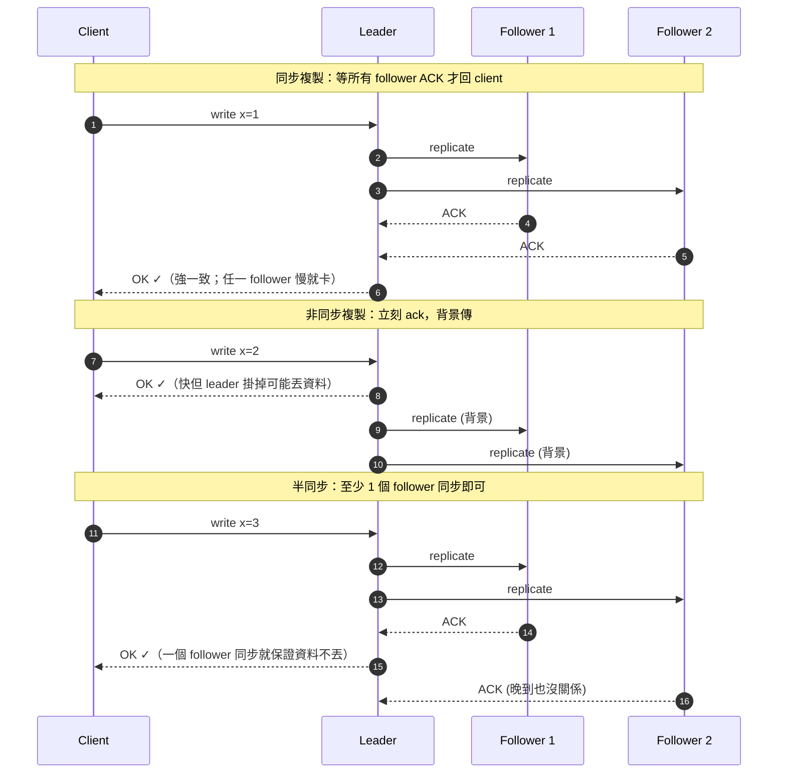
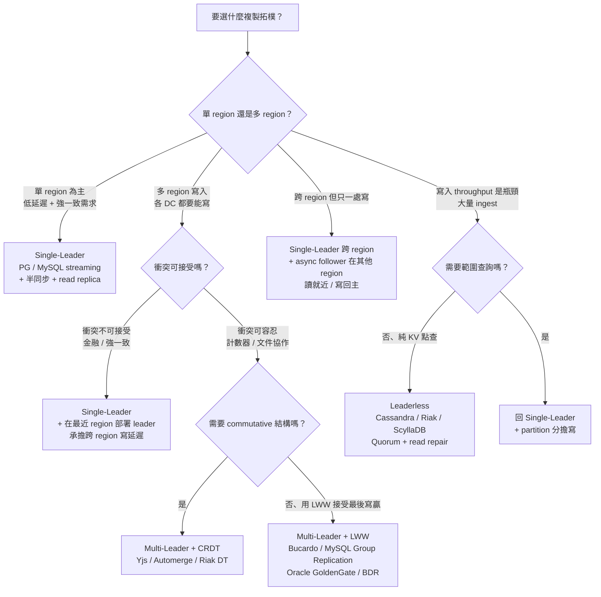

<ChapterOpener chapter-id="ch05" />

<ChapterMeta part="Part II 分散式資料" :read-time="55" difficulty="進階" :tags="['Leader/Follower', 'Quorum', 'CRDT']" prereq="Ch1, Ch3" />

<TLDR :points='[
  "<strong>複製 = 在多個節點存同一份資料的副本</strong>：動機是低延遲（地理近）、高可用（容錯）、高讀吞吐（讀分散）。",
  "<strong>三種架構</strong>：Single-Leader（最常見，PostgreSQL/MySQL）、Multi-Leader（跨資料中心）、Leaderless（Dynamo 風格，Cassandra/Riak）。",
  "<strong>同步 vs 非同步的權衡</strong>：同步保證一致性但任一節點掛掉整體卡死；非同步快但有資料丟失風險。實務常用「半同步」。",
  "<strong>複製延遲三大問題</strong>：read-your-writes、monotonic reads、consistent prefix reads —— 要靠應用層或路由策略解決。",
  "<strong>Leaderless 靠 Quorum</strong>：W + R > N 在「嚴格 quorum」下保證讀到最新值；Dynamo 風格啟用 sloppy quorum（鬆散法定人數 — 原節點不可達時暫寫到替代節點、待恢復後再同步回去）換可用性時不保證。版本向量（version vector）解決並發寫衝突。"
]' />

## 5.1 為什麼需要<G term="replication">複製</G>

- **降低延遲**：把資料放在使用者近的資料中心
- **提高可用性**：節點掛了還能服務
- **提高讀吞吐量**：讀請求可分散到 follower

但寫入需要被傳播到所有副本 → 這正是複雜度來源。

::: tip 如果你是前端開發者：你已經踩過這章的痛點
這幾個情境其實都是「**複製延遲**」造成的：

- **POST 一筆訂單後立刻 GET 列表，竟然看不到剛建的**——你打到的 read replica 還沒同步到。違反 **<G term="read-your-writes">read-your-writes</G>** 保證。
- **使用者刷新兩次，第二次看到比第一次更舊的資料（時光倒流）**——兩次請求被路由到不同 follower、其中一個更新較慢。違反 **<G term="monotonic-reads">monotonic reads</G>** 保證。
- **樂觀更新（optimistic UI）撞到 server 回應**：UI 已顯示「已按讚」、但 server 回 409 conflict——這是 multi-leader / leaderless 的並發寫衝突，要 client retry + CRDT 或 last-write-wins。

**典型 SDK 的處理**：
- Firestore 預設啟用 **offline cache + local mutation**，所以 POST 立刻 GET 拿到本地 cache，**看似** read-your-writes ✓——但是用 cache 不是真的同步到 server。（注意：Firestore server-side 在**單 region 內本就強一致**；offline cache 是把網路延遲遮掉、不是弱化保證。要看「server 端其他 client 多久看得到」才是真正的 replication 問題。）
- Supabase / PostgREST 預設讀 leader（沒 replica）→ 沒這問題；但若啟用 read replicas（PG hot standby）就有。
- 解法 a：寫後一段時間內 sticky 到 leader；解法 b：寫後帶 timestamp，要求 read replica 至少同步到該時間。
:::

---

## 5.2 Single-Leader 複製

```
       Client write
            ↓
        +-------+
        |Leader | → replication log
        +-------+
         /     \
   +--------+ +--------+
   |Follower| |Follower|
   +--------+ +--------+
        ↑          ↑
     Client read  Client read
```

### 同步 vs 非同步



- **同步**：寫入要等 follower ACK → 強一致但 follower 掛了卡寫入。實務範例：PostgreSQL `synchronous_commit=on` + `synchronous_standby_names`。
- **非同步**：寫入立刻 ack → 快，但 leader 掛了可能丟資料。MySQL 預設。
- **半同步**：至少一個 follower 同步、其餘非同步 → 實務常見折衷。MySQL 5.7 的 `rpl_semi_sync_master_wait_for_slave_count=1`、MySQL 8.0+ **改名為 `rpl_semi_sync_source_wait_for_replica_count`**（去除 master/slave 用詞，查官方文件要對應新版）。

::: warning DDIA 的「同步」≠「全部 follower ACK」
書中 / 業界談「synchronous」更常指**至少一個 standby 確認**（與本書「半同步」實質相同），**極少**系統真的要求「**所有** follower ACK」才回 client——那會把可用性殺爆。PostgreSQL 的 `synchronous_standby_names` 也支援 `FIRST 1 (s1,s2)` / `ANY 2 (s1,s2,s3)` 等配置，多數情況不是「所有」。上圖第一個 sequence 的「全部 ACK」是為了視覺對比的極端情境、非真實實作；MySQL 的「半同步」另設一格只是因為該特定模式名稱，邏輯上不是第三類。
:::

### Failover（主節點切換）的麻煩
1. 怎麼確定 leader 真的掛了？（網路抖動 vs 真當機）
2. 選誰當新 leader？（資料最新者）
3. 客戶端如何切到新 leader？
4. 舊 leader 復活後，被 demote 的它怎麼處理「比新 leader 還新的寫入」？→ **split-brain**

> GitHub 2012 故障：自動 failover 把舊 leader 的資料覆蓋掉新 leader，丟失資料。

---

## 5.3 複製延遲的三個問題

### 1. Read-your-writes（讀自己的寫）
你發了則貼文，刷新後看不到 → 因為 read 走的 follower 還沒收到。
**解法**：寫後一段時間內，自己的請求走 leader；或記住 client 寫入時的 log position，讀時要求 follower 進度 ≥ 該值。

### 2. Monotonic Reads（單調讀）
連續刷新兩次，第一次看到評論、第二次評論不見了（因為兩次打到不同 follower，第二個更舊）。
**解法**：同一使用者固定打到同一個 follower。

### 3. Consistent Prefix Reads（一致前綴讀）
觀察者看到「答案早於問題」—— 兩個分區間的因果順序被破壞。
**解法**：把因果相關的寫入放在同一分區；或實作**因果一致性協定**（用 vector clock 記錄因果依賴，並讓接收端依因果序遞送訊息）。注意 vector clock 本身只是工具，需配合「延後遞送」的傳遞層才能解決問題。

---

## 5.4 Multi-Leader 複製

每個資料中心一個 leader，互相複製。

優點：每個 DC 寫入低延遲、容忍跨 DC 網路問題
缺點：**寫入衝突**（同一筆資料在兩個 DC 同時被改）

### 衝突解決策略

| 策略 | 說明 | 風險 |
|---|---|---|
| Last-Write-Wins (LWW) | 用時間戳，最大勝（Cassandra / DynamoDB / Riak 預設策略） | 時鐘不同步 → 並發寫被靜默丟失 |
| 應用層 merge | 給 client 看到衝突，自己決定 | 複雜 |
| CRDT | 自動可合併資料結構 | 資料結構受限 |
| Mergeable persistent data | 像 git，保留分支 | 仍需應用處理 |

::: warning CockroachDB / Spanner / YugabyteDB ≠ LWW
這三家常被誤認為「用 HLC / TrueTime 做 LWW 衝突解決」，**其實不是**：它們是 **Raft single-leader-per-range**、每個資料範圍只有一個 leader 寫入，**根本不存在並發 multi-leader 寫衝突**。HLC / TrueTime 在這幾家用於 **MVCC 時間戳排序與外部一致性**（external consistency），不是用於解多寫者衝突。真正在「並發寫到不同副本、用時間戳挑勝者」的是 Cassandra / DynamoDB / Riak 這類 Dynamo-style leaderless 系統。
:::

---

## 5.5 Leaderless 複製（Dynamo 風格）

每個 client 直接寫**多個**副本，讀也讀**多個**副本。

### <G term="quorum">Quorum</G> 公式
- N：副本總數
- W：寫入需 ACK 數
- R：讀取需回應數
- **W + R > N** 在嚴格 quorum 下，可保證讀取時必定碰到至少一個含最新寫入的副本

::: tip 白話三句話
假設 **N = 3 個副本**，設 **W = 2、R = 2**：
1. 寫入時，要求 2 個副本確認才回 client OK（W=2）
2. 讀取時，問 2 個副本（R=2），挑時間戳最新的當答案
3. 因為 2 + 2 = 4 > 3，**讀到的 2 個副本裡至少有 1 個是剛剛寫過的** —— 從這個副本拿到的就是最新值

這就是 W + R > N 公式的全部直覺。容忍 N − max(W, R) = 1 個節點掛掉。
:::

例：N=3, W=2, R=2 → 容忍 1 個節點掛掉

::: warning Quorum 並非無條件保證
W+R>N 在下列情況**不保證**讀到最新值：
- **Sloppy quorum**：節點掛時，把寫入「臨時」轉交給原本不屬於該 key 的節點（hinted handoff）。**關鍵問題**：寫跑到「替補節點」，但讀仍對**原 home 節點集合**做 quorum read → **寫集與讀集完全不交集** → 讀就讀不到剛寫的最新值。Dynamo 用 hinted handoff 寫、replica 修復後背景傳回 home（Cassandra/Riak 預設啟用，以換取更高可用性）。
- **並發寫**：W+R>N 只解決「最新值存在」，不解決「誰是最新」—— 需搭配版本向量或時間戳判定。
- **節點故障切換期間**：副本切換時讀寫可能短暫打到不同節點集合。

純粹的 quorum 只是線性一致儲存的**必要條件之一**，不充分。要真正線性一致還需 read repair + write-back（ABD 演算法）。
:::

### 修復機制
- **Read repair**：讀到舊資料時順便寫回最新值
- **Anti-entropy process**：背景同步副本

### 版本向量（Version Vector）
解決並發寫衝突：每個**副本**維護自己的計數器，比較兩個版本判斷「誰是後代、誰是並發」。

```
A 寫 v=1, vector=[A:1]
B 並發寫 v=2, vector=[B:1]   ← 兩者無法比較，是衝突
合併後, vector=[A:1, B:1]
```

::: tip Version Vector ≠ Vector Clock
兩者形式相似但用途不同：
- **Vector Clock**（Lamport）：每個 **process** 一個計數器，用於分散式系統的因果序判定。
- **Version Vector**（Dynamo）：每個 **replica** 一個計數器，用於 KV store 的並發寫衝突偵測。

DDIA 提到的「版本向量」指後者。實務上的 Dynamo 系列文獻幾乎都用 version vector，但口語常被簡稱為「vector clock」造成混淆。
:::

---

## 5.6 複製拓樸選型決策樹

把 Single-Leader / Multi-Leader / Leaderless 三大架構的選型壓成一張圖：



**選型快速結論**：
- 預設選 **Single-Leader**（多數 web app 適用）
- 跨 region 寫但能容忍衝突 → **Multi-Leader + CRDT / LWW**
- 寫密集 + KV 點查 → **Leaderless**（Cassandra / Riak）
- **不要為了「未來可能跨 region」**先選 Multi-Leader——衝突解決的複雜度是寫應用 code 的隱形稅

::: warning Sloppy Quorum 的隱藏代價
選 Leaderless 時、Cassandra / Riak 預設啟用 **sloppy quorum**（節點掛時把寫轉到替補節點）→ **寫集與讀集可能不交集** → 即使 `W+R>N` 也讀不到剛寫的最新值。需要嚴格一致就要關掉 sloppy quorum（換可用性下降）、或改回 Single-Leader。
:::

---

## 章末練習

::: tip 思考題
1. 在 PostgreSQL 設定 streaming replication（主從複製），觀察 `pg_stat_replication` 中的延遲。
2. 模擬「read-your-writes」問題：寫入後立刻從 follower 讀，能否重現「看不到自己的寫入」？
3. 用 Python 實作一個 N=3, W=2, R=2 的簡易 leaderless KV store，包含 read repair。
:::

<Quiz chapter-id="ch05" :questions='[
  {
    difficulty: "applied",
    question: "「半同步複製」的設計動機是？",
    options: [
      "省記憶體",
      "在全同步的一致性與全非同步的可用性之間取得平衡，至少一個 follower 同步即可繼續",
      "讓 leader 不需要 WAL",
      "支援多 leader 架構"
    ],
    answer: 1,
    explanation: "全同步：任一 follower 掛就卡寫。全非同步：leader 掛就丟資料。半同步：要求至少一個 follower 同步，既保證資料不丟，又不會被任一節點拖死。"
  },
  {
    difficulty: "applied",
    question: "Quorum 公式 W + R > N 保證的是？",
    options: [
      "讀寫操作的延遲下限",
      "讀取集合與寫入集合至少有一個節點重疊，因此能讀到最新寫入值",
      "資料的物理冗餘度",
      "節點之間的同步間隔"
    ],
    answer: 1,
    explanation: "W 個寫副本 + R 個讀副本 > N 個總副本 → 鴿巢原理保證讀集和寫集有交集，因此讀必能看到最新值（前提是無並發寫衝突）。"
  },
  {
    difficulty: "basic",
    question: "「Read-your-writes consistency」要解決的問題是？",
    options: [
      "兩個使用者看到不同順序的事件",
      "使用者自己寫入後立即讀取卻看不到自己剛寫的值",
      "資料在不同分區之間順序不一致",
      "Failover 時資料遺失"
    ],
    answer: 1,
    explanation: "由於非同步複製延遲，寫入後立刻去 follower 讀可能讀到舊值。「讀自己的寫」要求至少對寫入者本人能立即看到結果（其他人可能仍看到舊值）。"
  },
  {
    difficulty: "interview",
    question: "Multi-Leader 架構中，下列哪個是「最後寫入勝出（LWW）」衝突解決的主要風險？",
    options: [
      "效能太慢",
      "依賴節點時鐘，時鐘不同步會導致寫入被靜默丟失",
      "需要太多記憶體",
      "無法用於跨資料中心"
    ],
    answer: 1,
    explanation: "LWW 用時間戳比大小，但分散式系統的時鐘有漂移（Ch8 主題）。若節點 A 的時鐘比真實世界落後，A 上「較新」的寫入會打上**較小**的時間戳、在 LWW 比較中輸給時鐘較準節點 B 的「較舊」寫入 → 較新的資料被靜默丟失。HLC 可緩解但無法消除此問題（CockroachDB / Spanner 用 single-leader Raft 從根本避開 multi-leader 衝突、不採 LWW）。"
  },
  {
    difficulty: "basic",
    question: "你用 PostgreSQL async streaming replication、把讀流量導到 follower。最容易在使用者體驗上踩到的問題是？",
    options: [
      "Follower 完全不能讀",
      "Follower 因複製延遲落後 leader 數百毫秒以上，使用者剛寫完立刻刷新可能看不到自己的寫入（read-your-writes 問題）",
      "Follower 自動 promote 成新 leader、原 leader 變唯讀",
      "Follower 跑得比 leader 快、更新先到"
    ],
    answer: 1,
    explanation: "Async replication 本質：leader commit 後才把 WAL 送 follower —— follower 永遠有一段 lag（通常 < 100ms、網路抖動可飆到秒級）。使用者寫完導到 follower 讀可能讀到舊值。三種應用層修法：(a) 寫後固定時間導 leader、(b) 用 monotonic-read session sticky、(c) 用 read-your-writes 邏輯時間戳等候 follower 追上。"
  },
  {
    difficulty: "interview",
    question: "Multi-Leader 系統用 LWW 解衝突、跟 Ch9 的 Linearizability（線性一致）兼容嗎？",
    options: [
      "兼容 —— LWW 提供事件全序排序、符合線性一致定義",
      "不兼容 —— LWW 靠時鐘排序，時鐘漂移時可能讓「真實時序較早」的寫帶較大時間戳贏掉「較晚」的寫，外部觀察者看到的順序與真實時序不一致",
      "只有跨資料中心時才不兼容",
      "Linearizability 不適用於 multi-leader 系統的討論範圍"
    ],
    answer: 1,
    explanation: "Linearizability 要求每個讀請求看到「最新已 commit」的值、且所有讀寫順序可序列化為單一 timeline、與真實時序一致。LWW 在時鐘漂移時可能讓真實時序較早的寫贏掉較晚的 —— 觀察者看到的順序就不再與真實時序一致。Ch9 強調：要真正線性一致必須用 consensus（Raft / Paxos）、不能只靠時鐘戳。Multi-leader + LWW 是 AP 系統的設計選擇，本來就不追求線性一致 —— 兩者目標不同、本質衝突。"
  }
]' />

<InterviewBlock chapter-id="ch05" :questions='[
  { "tag": "Read replica", "question": "你的應用看到「使用者寫完一筆資料、刷新後立刻 GET 看不到」。請說明可能的原因、以及至少兩種修法（含取捨）。" },
  { "tag": "一致性取捨", "question": "請說明同步 / 半同步 / 非同步複製的取捨。如果是金融轉帳系統，你會選哪個？依據是什麼？PG / MySQL 預設行為各是什麼？" },
  { "tag": "Quorum", "question": "Sloppy quorum 為什麼不保證 W+R>N 線性一致？請用「寫集 vs 讀集」的角度具體舉例。" }
]' />

<ChapterNote chapter-id="ch05" />

<Progress chapter-id="ch05" />

::: info 延伸閱讀
- [Jepsen analyses](https://jepsen.io/analyses) — 對各 DB（Cassandra / MongoDB / etcd / Redis 等）實際做了複製一致性測試
- [PostgreSQL Streaming Replication](https://www.postgresql.org/docs/current/warm-standby.html) — 官方文件，動手必看
- [Dynamo: Amazon's Highly Available Key-value Store](https://www.allthingsdistributed.com/files/amazon-dynamo-sosp2007.pdf) — Leaderless / Quorum 的原始論文
:::

<NextChapterBridge chapter-id="ch05" />
