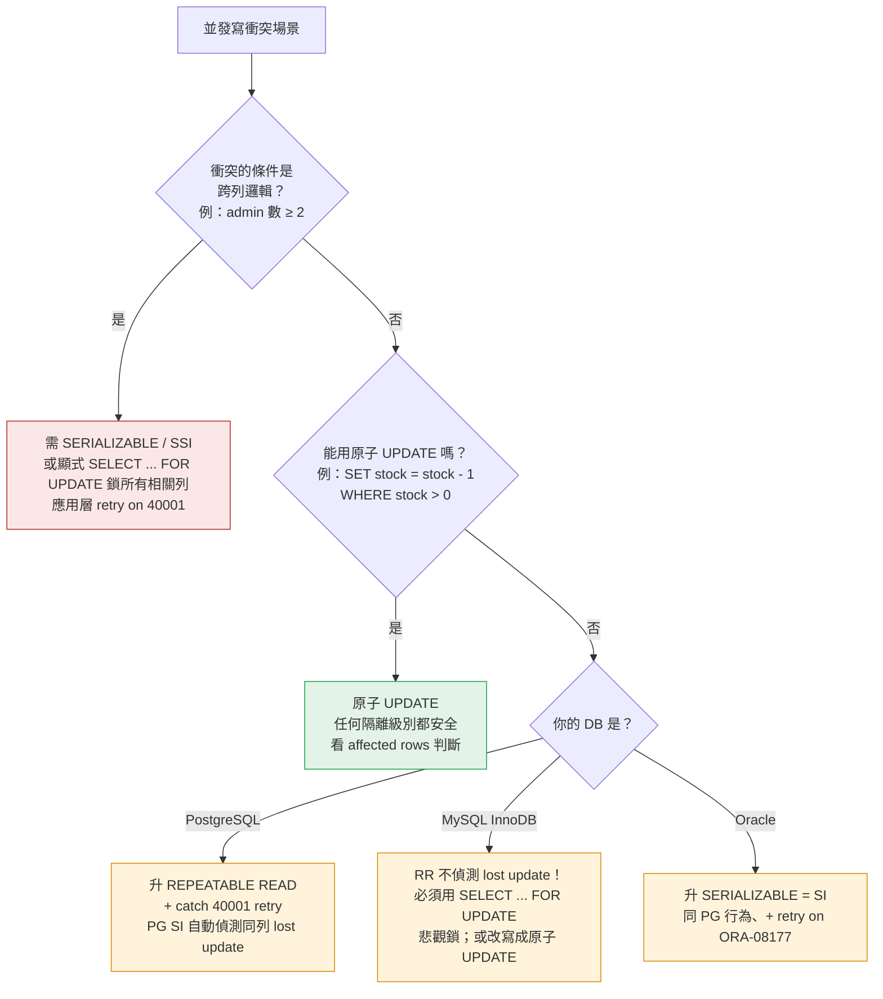

# Ch7 · 交易 Transactions

<ChapterMeta part="Part II 分散式資料" :read-time="60" difficulty="進階" :tags="['ACID', 'Isolation', 'Serializable']" prereq="Ch5, Ch6" />

<TLDR :points='[
  "<strong>ACID 並非鐵板一塊的概念</strong>：A/I/D 各家 DB 詮釋不一，C（一致性）甚至是應用責任不是 DB 責任。",
  "<strong>弱隔離級別有經典異常</strong>：Read Committed → 解決 dirty read/write；Snapshot Isolation → 解決 non-repeatable read 與「讀取階段的 phantom」；但仍擋不住 lost update（PG/Oracle 在 SI/REPEATABLE READ 才會自動偵測、READ COMMITTED 預設不偵測）、write skew、以及「基於不存在性寫入決策」的 phantom-based write skew。",
  "<strong>Snapshot Isolation 用 MVCC 實作</strong>：每筆交易看到「開始時的快照」，讀不阻塞寫、寫不阻塞讀，是現代 DB 主流（PostgreSQL、Oracle）。",
  "<strong>Lost Update vs Write Skew</strong>：兩者都是並發異常，但 write skew 涉及「跨列的約束」，SI 也無法解決，需要 SSI 或顯式鎖。",
  "<strong>真正的 Serializable 有三種實作</strong>：Actual Serial Execution（VoltDB 單執行緒）、2PL（傳統鎖）、SSI（樂觀並發控制，PostgreSQL 9.1+）。"
]' />

## 7.0 為什麼需要交易？

::: tip 從一個具體場景出發
Alice 要轉 100 元給 Bob：
```sql
UPDATE accounts SET balance = balance - 100 WHERE user = 'Alice';
UPDATE accounts SET balance = balance + 100 WHERE user = 'Bob';
```

如果第一行成功、第二行**斷網了**或**程式崩潰了**，怎麼辦？Alice 少了 100 元、Bob 沒收到 —— 100 元憑空消失。

**交易（transaction）** 就是用來解決這類問題：把多個操作打包成「全部成功，或全部不發生」的單位。

```sql
BEGIN;
  UPDATE accounts SET balance = balance - 100 WHERE user = 'Alice';
  UPDATE accounts SET balance = balance + 100 WHERE user = 'Bob';
COMMIT;
-- 如果中途失敗，自動 ROLLBACK
```
:::

如果你寫的 CRUD 都靠 ORM 一行 `User.create()` 解決，**沒手動下過 BEGIN/COMMIT** —— 那這章會打開你的視野。即使你沒明寫，框架底下也在替你做這件事。

---

## 7.1 <G term="acid">ACID</G> 的真相

| 字母 | 名義意義 | 真相 |
|---|---|---|
| **A**tomicity | 原子性 | DB 真的保證（crash 時 rollback） |
| **C**onsistency | 一致性 | **應用層責任**（DB 只提供工具） |
| **I**solation | 隔離性 | 完整實作昂貴，多數 DB 預設只給弱版本 |
| **D**urability | 持久性 | 寫入後不丟（搭配 WAL、複製） |

---

## 7.2 弱<G term="isolation-level">隔離級別</G>與異常

### Read Committed（多數 DB 預設）
- ✓ 不會 dirty read（讀不到未 commit 的資料）
- ✓ 不會 dirty write（覆蓋未 commit 的寫）
- ✗ 仍有 **non-repeatable read**（同交易兩次讀到不同值）

### <G term="snapshot-isolation">Snapshot Isolation</G>（PostgreSQL repeatable read, Oracle <G term="serializability">serializable</G>）

::: warning 命名地獄：REPEATABLE READ 在各家 DB 是不同東西
SQL 標準的 REPEATABLE READ 並未要求防止 phantom，且各家詮釋差異極大：
- **PostgreSQL** 的 REPEATABLE READ = 完整的 Snapshot Isolation
- **MySQL InnoDB** 的 REPEATABLE READ 接近 SI，但對 phantom 行為不同（gap lock）
- **Oracle** 沒有真正的 REPEATABLE READ；它的「Serializable」其實是 SI

讀文件看到「REPEATABLE READ」時，**永遠先查具體 DB 的實際語意**。
:::

**MVCC（Multi-Version Concurrency Control）** 實作：
- 每筆寫產生新版本，附帶 transaction id
- 讀取時根據自己的 snapshot timestamp 過濾出當時可見的版本
- 讀不加鎖 → 讀寫互不阻塞

::: tip PostgreSQL MVCC 怎麼真的存
每列附帶兩個隱藏欄位：
- `xmin`：建立該版本的交易 ID
- `xmax`：刪除 / 更新該版本的交易 ID（0 表示仍有效）

`UPDATE` 並非「就地改」，而是「**插入新版本** + 把舊版本的 `xmax` 設為當前 tx」。讀取時根據自己的 snapshot 過濾出可見版本（`xmin ≤ snapshot` 且 `xmax > snapshot` 或為 0）。

**副作用**：表會膨脹（dead tuple），需要 `VACUUM` 回收 —— 這就是 PostgreSQL 著名的 vacuum 維運痛點來源。
:::

### Lost Update 問題 {#lost-update-issue}

抽象範例：
```
T1 read counter (=5)
T2 read counter (=5)
T1 write counter = 6
T2 write counter = 6   ← 應該是 7！
```

**真實場景：電商扣庫存**（兩個客人同時搶最後 1 件）
```sql
T1: SELECT stock FROM items WHERE id=1;   -- 讀到 1
T2: SELECT stock FROM items WHERE id=1;   -- 讀到 1（並發）
T1: UPDATE items SET stock=0 WHERE id=1;  -- OK
T2: UPDATE items SET stock=0 WHERE id=1;  -- ← 超賣！本該失敗
```

**三種解法的實際 SQL**：

```sql
-- (a) 原子操作（最簡單，能用就用）
UPDATE items SET stock = stock - 1
  WHERE id = 1 AND stock > 0;
-- 看 affected rows 判斷是否真的扣到：0 = 賣完，1 = 成功
```

```sql
-- (b) 悲觀鎖：SELECT 時就把列鎖住
BEGIN;
  SELECT stock FROM items WHERE id = 1 FOR UPDATE;
  -- 另一交易在此 SELECT FOR UPDATE 會阻塞
  UPDATE items SET stock = stock - 1 WHERE id = 1;
COMMIT;
```

```sql
-- (c) 樂觀鎖（CAS via version）：先讀 version，更新時比對
SELECT stock, version FROM items WHERE id = 1;  -- version = 7
UPDATE items SET stock = stock - 1, version = version + 1
  WHERE id = 1 AND version = 7;
-- affected rows = 0 → 有人比你早改，retry
```

### Write Skew（SI 也擋不住） {#write-skew}

兩個醫生同時值班，**業務規則：至少要有一人值班**。應用程式的邏輯是：請假前先查「目前還有幾人值班」，若 ≥ 2 才放行。

```sql
-- T1 (Alice 想請假)
SELECT count(*) FROM doctors WHERE on_call = true;  -- 2 → 通過檢查
UPDATE doctors SET on_call = false WHERE id = 'Alice';

-- T2 (Bob 同時想請假，並發)
SELECT count(*) FROM doctors WHERE on_call = true;  -- 2（讀到 SI 快照）→ 通過檢查
UPDATE doctors SET on_call = false WHERE id = 'Bob';

COMMIT (both);  -- ← 兩人都休了，違反業務規則
```

兩者都讀了相同前提（2 人值班）、**各自寫不同列**（Alice / Bob），SI 看不出衝突 —— 因為衝突發生在「對前提的依賴」而非「實體列」。

**解法**：用 `SERIALIZABLE` 隔離級別（PostgreSQL 的 SSI 會 abort 其中一個交易）或 `SELECT ... FOR UPDATE` 把所有相關列鎖起來。

::: tip 換成前端 / 全端日常的例子（兩種異常分清楚）
醫生班表離前端遠，換成後台日常 —— **但要注意 lost update 與 write skew 是兩種不同異常**：

<span class="ddia-scenario-badge danger">A · WRITE SKEW</span> **管理後台「最後一位管理員不能離職」**
規則：「至少要有一位管理員」。兩位 admin 同時送離職單：

```sql
-- T1, T2 同時跑：
SELECT count(*) FROM users WHERE role='admin' AND active=true;  -- 都讀到 2
UPDATE users SET active=false WHERE id=自己;
```

兩交易**讀同前提**（admin 數 ≥ 2）、**寫不同列**（各改各自的 active）。SI **擋不住**（這就是真正的 write skew、與醫生班表同構）—— **需 Serializable / SSI 才會 abort 其一**。

<span class="ddia-scenario-badge safe">B · LOST UPDATE · 安全</span> **優惠券「最後一張」用原子操作**
```sql
UPDATE coupons SET remaining = remaining - 1 WHERE id=X;
```

只要寫成這種「就地遞減」的原子 UPDATE，**任何隔離級別（包含預設的 READ COMMITTED）都安全**——DB 會用 row lock 把兩個 UPDATE 序列化，第二個讀到第一個 commit 後的新版本再扣。安全來自「原子 UPDATE」這個寫法本身，不來自隔離級別。

<span class="ddia-scenario-badge warn">C · LOST UPDATE · 有坑</span> **「讀檢查 → 寫新值」**
```sql
SELECT remaining FROM coupons WHERE id=X;  -- 讀到 1
-- 應用層判斷 ≥ 1
UPDATE coupons SET remaining = 0 WHERE id=X;  -- 寫死新值
```

兩交易都這樣做 → 都讀到 1、都寫 0 → **處理了兩筆訂單卻只扣了 1 次庫存**。在不同隔離級別下行為不同：

- **READ COMMITTED（PG/MySQL 預設）**：PG **不偵測** lost update——第二個 UPDATE 阻塞等鎖、解鎖後直接寫上去 → **靜默 lost update**。MySQL InnoDB 預設也是這種行為
- **REPEATABLE READ / SERIALIZABLE**（需顯式 `BEGIN ISOLATION LEVEL REPEATABLE READ`）：PG / Oracle 才會自動偵測同列並發 UPDATE → 第二個 abort with `40001 could not serialize access due to concurrent update`。**MySQL InnoDB 的 RR 仍不偵測 lost update**（與 PG 不同）

**通則**：
- **不要靠預設隔離級別擋 lost update**——預設是 READ COMMITTED、不擋
- **「先讀再判斷再寫」要嘛升到 REPEATABLE READ + retry on `40001`，要嘛改寫成原子 UPDATE**（情境 B）
- **能用原子操作就用**（`SET col = col + n`）—— 在任何隔離級別都安全
- **跨列前提**（情境 A）才升 `SERIALIZABLE` 或顯式 `FOR UPDATE`
:::

#### 決策樹：lost update / write skew 選哪招？

把通則畫成 mermaid 決策樹，PR review 時可直接照走：



**讀法**：
- 🔴 **A 分支**（write skew）：最嚴重、效能代價最高
- 🟢 **B 分支**（原子 UPDATE）：最簡單、最安全、能用就用
- 🟡 **C/D/E 分支**（DB-specific lost update 處理）：要 retry on 序列化錯誤、必須測過 application code 對 retry 的容忍度

實務上 90% 的 lost update 場景可以走 **B 分支**（原子 UPDATE），剩下 10% 走 A / C / D / E。**寫 code 前先問「能不能用原子操作」**——能就避開後面所有麻煩。

### Phantom 問題
Phantom 是 Write Skew 的一種特殊形式 —— 寫入決策基於「查詢條件下沒有列存在」，但同時另一交易插入了符合該條件的列。

**Phantom 的 SQL 重現**（PostgreSQL `REPEATABLE READ` 下會發生）：
```sql
-- Session A
BEGIN ISOLATION LEVEL REPEATABLE READ;
SELECT count(*) FROM bookings
  WHERE room = 1 AND start_time < '13:00' AND end_time > '12:00';
-- 結果 = 0，沒人預訂 → 應用程式決定可以訂

-- Session B (並發)
BEGIN ISOLATION LEVEL REPEATABLE READ;
SELECT count(*) FROM bookings WHERE ...;  -- 結果也是 0
INSERT INTO bookings VALUES (1, '12:00', '13:00', 'Bob');
COMMIT;

-- Session A 繼續
INSERT INTO bookings VALUES (1, '12:00', '13:00', 'Alice');
COMMIT;  -- ← 兩筆都成功，雙重預訂！
```

本質：寫入是基於「不存在某筆資料」的判斷，但 SI 無法鎖「未存在的東西」。

**解法**：用 `SERIALIZABLE`（PostgreSQL SSI 會在 commit 階段 abort 其中之一），或建立「存在性檢查表」（如 `room_slots`）把「沒列」轉成「鎖某列」。

---

### 異常 × 隔離級別對照矩陣

各隔離級別「保護你免於」哪些異常：

| 異常 \ 隔離級別 | Read Uncommitted | Read Committed | Snapshot Isolation | Serializable |
|---|:---:|:---:|:---:|:---:|
| Dirty Read | ✗ 仍會發生 | ✓ 防止 | ✓ | ✓ |
| Dirty Write | ✗ | ✓ | ✓ | ✓ |
| Read Skew（non-repeatable read） | ✗ | ✗ | ✓ | ✓ |
| **Lost Update（同列「先讀再寫」）** | ✗ | ✗（PG/MySQL 預設不偵測） | ⚠️ PG/Oracle 在 SI/RR 偵測 → `40001` abort（MySQL InnoDB RR **仍不偵測**） | ✓ |
| **Lost Update（跨列邏輯依賴）** | ✗ | ✗ | ✗ 不偵測、需應用 retry | ✓（SSI 才偵測為 write skew 變體） |
| Write Skew | ✗ | ✗ | ✗ **仍會發生** | ✓ |
| Phantom Read（**讀**走快照看不到新插入） | ✗ | ✗ | ✓ | ✓ |
| Phantom-based Write Skew（**基於不存在性寫入決策**被打破） | ✗ | ✗ | ✗ | ✓（SSI / 2PL with predicate lock） |

::: warning Phantom 在 SI 下要分兩種看
**讀取階段的 phantom**（同交易兩次範圍查詢得不同列集合）—— SI 因為讀走快照能擋住。
**寫入決策的 phantom**（讀「沒有衝突會議」→ 寫一個會議；另一交易也讀「沒有衝突」→ 也寫一個，commit 後**共同違反原本檢查的前提**）—— 這是 Write Skew 的特例，SI **擋不住**，因為 SI 只能對「已存在的列」做衝突偵測。

Berenson et al. 1995《A Critique of ANSI SQL Isolation Levels》對應：**A3 = Phantom Read**（讀取階段看到 phantom）、**A5B = Write Skew**（經典跨列寫偏差，醫生班表）；本框「寫入決策的 phantom」其實是把 A3 phantom 條件延伸到 write skew 場景，原典沒有獨立編號。
:::

::: warning 命名 vs 實作差異
SQL 標準的隔離級別命名與各家 DB 實作差異極大（見 §7.2 「命名地獄」警告框）。**永遠以「實際擋住哪些異常」而非「叫什麼名字」來理解隔離級別**。
:::

---

### 各家 DB 隔離級別實際對照

評估從 `Oracle on-prem` 遷雲、選 `Aurora` / `CockroachDB` / `Spanner` 時必查的對照表。同樣叫「Serializable」、行為差異極大：

| DB | 命名 → 實際語意 | Lost Update（同列） | Write Skew | Phantom Read | 備註 |
|---|---|:---:|:---:|:---:|---|
| **PostgreSQL** | `READ COMMITTED`（預設） | ✗ 不偵測 | ✗ | ✗ | First-updater-wins 阻塞等鎖 |
| | `REPEATABLE READ` = SI | ⚠ 偵測 → `40001` | ✗ | ✓ 讀走快照 | MVCC + lost update detection |
| | `SERIALIZABLE` = SSI | ⚠ 偵測 | ✓ | ✓ | Cahill 2008、用 SIREAD 偵測 rw-dep cycle |
| **MySQL InnoDB** | `READ COMMITTED` | ✗ | ✗ | ✗ | |
| | `REPEATABLE READ`（預設） | ✗ **仍不偵測** | ✗ | ✓ 用 next-key locking | **與 PG 不同！**lost update 靜默覆蓋 |
| | `SERIALIZABLE` | ✓ 強加 share lock | ✓ | ✓ | 實質 2PL、效能差 |
| **Oracle** | `READ COMMITTED`（預設） | ✗ | ✗ | ✗ | |
| | `SERIALIZABLE` = SI（**騙人命名**） | ⚠ 偵測 | ✗ | ✓ | 其實是 Snapshot Isolation |
| **SQL Server** | `READ COMMITTED`（預設） | ✗ | ✗ | ✗ | 鎖式 RC |
| | `READ COMMITTED SNAPSHOT` | ✗ | ✗ | ✗ | 啟用 row-versioning 後類似 PG RC |
| | `SNAPSHOT` = SI | ⚠ 偵測 | ✗ | ✓ | |
| | `SERIALIZABLE` | ✓ | ✓ | ✓ | Strict 2PL + range lock |
| **CockroachDB** | `SERIALIZABLE`（預設、長期唯一） | ✓ | ✓ | ✓ | 基於 HLC + SSI；v23.1（2023）才加回 `READ COMMITTED` 作可選 |
| **Spanner** | `SERIALIZABLE`（強一致讀寫） | ✓ | ✓ | ✓ | 基於 TrueTime；額外提供 stale read 模式 |
| **DynamoDB** | Single-item: linearizable / Multi-item: SERIALIZABLE（Transactions API） | ✓ | ✓（限同 TX） | ✓（限同 TX） | 跨 item 必須包進 `TransactWriteItems` |
| **Aurora PostgreSQL** | 同 PG（PG-compatible 模式） | 同 PG | 同 PG | 同 PG | 共享儲存層、隔離級別不變 |
| **TiDB** | `REPEATABLE READ`（預設）/ Optimistic & Pessimistic | ⚠（pessimistic 模式偵測） | ✗ | ✓ | MySQL-compatible、底層 Percolator |

**閱讀法**：
- ✓ = 該異常被擋
- ⚠ = 偵測到 → 第二交易以序列化錯誤 abort（`40001` 或對應 SQLSTATE）、應用層需 retry
- ✗ = 不偵測、會靜默發生

::: warning 跨 DB 遷移最常踩的坑
1. **MySQL → PG**：以為 `REPEATABLE READ` 行為一樣 → 結果原本 MySQL 下被「rollback 容忍」的 lost update 在 PG 變 `40001` 拋例外 → 應用層沒接 retry → 故障
2. **Oracle → PG**：以為 Oracle 的 SERIALIZABLE 是真序列化 → 遷到 PG SERIALIZABLE 才發現「咦怎麼會被 abort，Oracle 沒這問題」（其實 Oracle 是 SI、本來就允許 write skew）
3. **PG → CockroachDB**：CRDB 只有 SERIALIZABLE，任何「先讀 → 應用層判斷 → 寫」的 PR 都可能 abort、需全面 retry
4. **任何 DB → DynamoDB**：跨 item 操作必須包 `TransactWriteItems` API，否則沒有 ACID
:::

---

## 7.3 Serializable 的三種實作

### 1. Actual Serial Execution
真的就單執行緒跑（VoltDB、Redis、H-Store）。
- 前提：交易**短小**、**所有資料在記憶體**、**用 stored procedure 預先送進來**
- 一台機器搞不定就分區 + 跨分區交易（變慢）

### 2. Two-Phase Locking (2PL) {#two-phase-locking}
讀加共享鎖、寫加排他鎖。
- **Strict 2PL**（實務上幾乎都這版本）：鎖**到 commit 才釋放**，避免 cascade abort（另一交易若讀了未 commit 的值、跟著 commit、然後原交易 rollback → 連鎖回滾）
- 普通 2PL 只要求「**取鎖階段**結束才能進**釋鎖階段**」、釋鎖後不能再取鎖，但這不阻擋 cascade abort
- ✓ 真正可序列化
- ✗ 死鎖頻繁、效能差（讀也會被阻塞）
- 傳統 DB 的「serializable」往往就是 Strict 2PL

#### 解決 Phantom：謂詞鎖 / 索引範圍鎖
鎖「符合條件的所有列」（包括未存在的）。

::: tip 完整謂詞鎖太貴、實務改用 index-range locking
**Predicate lock**（基於 WHERE 條件鎖）的維護成本高（每次 commit 都要對其他並發交易的讀寫做謂詞匹配），實務 DB 多用近似實作：
- **MySQL InnoDB**：**next-key locking** = record lock + gap lock，鎖住「索引範圍」（涵蓋符合條件的列 + 它們之間的間隙）
- **PostgreSQL SSI**：用 **SIREAD lock**（軟鎖，不阻塞，只紀錄讀集）+ commit 時偵測 rw-dependency cycle

讀者照「謂詞鎖」字面去找 MySQL 文件會找不到 ——「gap lock」「next-key lock」才是實際關鍵字。
:::

### 3. Serializable Snapshot Isolation (SSI)
2008 後的學術成果，PostgreSQL 9.1 採用。
- 樂觀執行（用 SI）+ 提交時偵測衝突 → 衝突就 abort
- 用「過時的前提（stale premise）」偵測：T1 讀的資料被 T2 改了，且 T1 也寫了 → abort T1
- ✓ 接近 SI 的效能 + 真正可序列化
- ✗ 衝突率高時 abort 多

::: tip 如果你是前端開發者：Firestore `runTransaction` 的精神接近 SSI / OCC
Firestore 的 `runTransaction((tx) => ...)` API **精神接近 SSI / OCC**（Optimistic Concurrency Control）—— Google 文件稱 OCC、學術上對應 SSI 的「stale premise 偵測」想法，雖然不是 Cahill 2008 SSI 演算法的直接實作：

```js
await db.runTransaction(async (tx) => {
  const ref = db.doc('counters/x')
  const snap = await tx.get(ref)         // 1. 讀（記下 read set）
  if (snap.data().count < 10) {          // 2. 應用層判斷
    tx.update(ref, { count: snap.data().count + 1 })  // 3. 寫
  }
})
```

- **樂觀執行**：transaction body 跑時不鎖；commit 時 server 驗 read set 是否被別人改過
- **偵測衝突 → 自動 retry**：Firestore client SDK 預設最多 retry 5 次（SI/SSI 在 DB 端的 abort、SDK 端的「換新 snapshot 重做」自動化）
- **read set 必須早於 write**：SDK 強制這個順序，否則拋錯——這也是教學版的 SSI「先讀完再決定要不要寫」設計

理解 Ch7 的 SSI 就能回頭看懂為什麼 `runTransaction` body 要寫成「先 `tx.get(...)`、再決定 `tx.update(...)`」—— **這個約束不是 API 設計怪癖、是樂觀並發控制的必要條件**（commit 時要驗證 read set 沒被改、所以 read 必須先全部完成）。
:::

---

## 章末練習

::: tip 思考題
在 PostgreSQL 開兩個 session，分別嘗試：
1. 用 default isolation 重現 lost update
2. 改 `REPEATABLE READ`，能解決嗎？
3. 用 transfer 跨帳戶轉帳的腳本重現 write skew
4. 改 `SERIALIZABLE`，觀察 PostgreSQL 何時 abort 交易
:::

<Quiz chapter-id="ch07" :questions='[
  {
    question: "Snapshot Isolation 仍然可能發生下列哪一種異常？",
    options: [
      "Dirty Read",
      "Non-repeatable Read",
      "Write Skew",
      "Dirty Write"
    ],
    answer: 2,
    explanation: "SI 解決 dirty read/write 與 non-repeatable read。但 Write Skew 涉及「兩個交易各自基於相同前提、做不衝突的寫」，SI 看不到衝突 —— 需要 Serializable（SSI 或 2PL）才能擋。",
    sectionAnchor: "write-skew"
  },
  {
    question: "PostgreSQL 的 SERIALIZABLE 採用 SSI，相對於 2PL 的主要差別是？",
    options: [
      "SSI 不保證可序列化",
      "SSI 樂觀執行、commit 時偵測衝突並 abort；2PL 悲觀加鎖、阻塞他人",
      "SSI 只能用於 in-memory 資料庫",
      "SSI 需要單執行緒執行"
    ],
    answer: 1,
    explanation: "2PL 是悲觀並發控制（加鎖等待），SSI 是樂觀並發控制（先做，commit 時驗證）。SSI 對讀多寫少、衝突率低的工作負載效能好；衝突多時會頻繁 abort + retry。",
    sectionAnchor: "two-phase-locking"
  },
  {
    question: "ACID 中的「C」（Consistency）的真相是？",
    options: [
      "由 DB 完全保證",
      "其實主要是應用層責任，DB 只提供原子性/隔離性等工具去達成業務約束",
      "等同於分散式系統中的線性一致性",
      "代表所有節點看到相同資料"
    ],
    answer: 1,
    explanation: "DDIA 直言「C 是 ACID 中的混入字」。它指業務不變式（如「帳戶餘額不能為負」），這得由應用邏輯確保，DB 只負責 A/I/D 給你保護這些約束的工具。"
  },
  {
    question: "下列哪個是「Lost Update」的可靠解法？",
    options: [
      "完全靠應用程式重試",
      "用原子更新 `UPDATE x SET v = v + 1` 或 `SELECT ... FOR UPDATE` 顯式鎖定",
      "把所有交易設為 READ COMMITTED",
      "增加副本數量"
    ],
    answer: 1,
    explanation: "Lost update 來自「讀-改-寫」的非原子模式。解法：(a) 用 DB 提供的原子操作；(b) `FOR UPDATE` 在讀的時候就加鎖；(c) 樂觀鎖 + version 欄位的 CAS。",
    sectionAnchor: "lost-update-issue"
  }
]' />

<InterviewBlock chapter-id="ch07" :questions='[
  { "tag": "Lost update", "question": "兩個 client 同時做「讀庫存 → 判斷 ≥ 1 → 扣 1」。用 PostgreSQL 預設隔離級別會發生什麼？修法至少給三種（原子 UPDATE / FOR UPDATE / 升 RR + retry）並說明取捨。" },
  { "tag": "Write skew", "question": "「最後一位管理員不能離職」這個業務規則、在 Snapshot Isolation 下會發生什麼？怎麼修？跟 lost update 有何不同？" },
  { "tag": "跨 DB 遷移", "question": "你公司從 MySQL InnoDB 遷到 PostgreSQL。應用程式有哪幾類 SQL 行為要重新驗證？提示：MySQL RR vs PG RR 行為差異。" }
]' />

<ChapterNote chapter-id="ch07" />

<Progress chapter-id="ch07" />

::: info 延伸閱讀
- [ept/hermitage](https://github.com/ept/hermitage) — Martin Kleppmann 親手整理的「各 DB 在各 isolation level 下會發生哪些異常」測試 repo，**clone 即可跑**。實測會看到：**MySQL RR 仍會 lost update**（不 abort、靜默覆蓋）、**Oracle Serializable 仍會 write skew**（其實是 SI 改名）、**PG SSI 真的擋得住 write skew** 但 throughput 因 abort 變高。先帶著這些預期再去看實測，會很扎實
- [Jepsen — PostgreSQL 12.3](https://jepsen.io/analyses/postgresql-12.3) — 真實的 SSI 異常分析
- [A Critique of ANSI SQL Isolation Levels](https://www.microsoft.com/en-us/research/wp-content/uploads/2016/02/tr-95-51.pdf) — Berenson et al. 1995，揭示 SQL 標準命名地獄的源頭
:::

<NextChapterBridge next-link="/part-2/ch08-trouble" next-title="Ch8 分散式系統的麻煩">
本章 SI 的快照、Serializable 的鎖，<strong>都假設「網路可靠、時鐘準確、行程不會無預警暫停」</strong>。下一章打碎這個假設 —— 真實分散式系統會碰到部分失效、時鐘漂移、stop-the-world GC，這些痛點正是 Ch9 共識演算法（Raft / Paxos）要解決的問題。
</NextChapterBridge>
