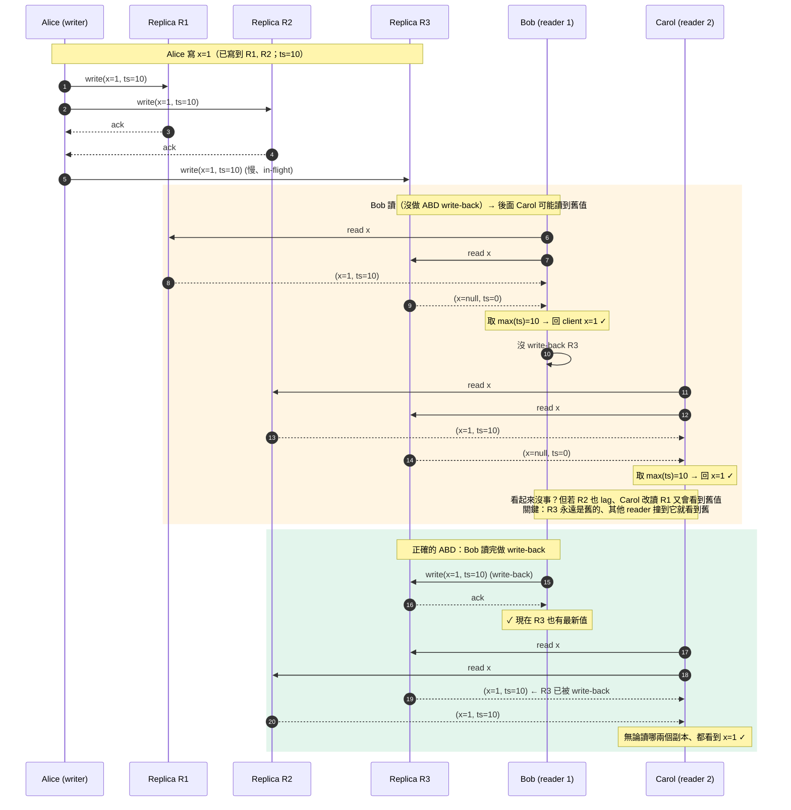
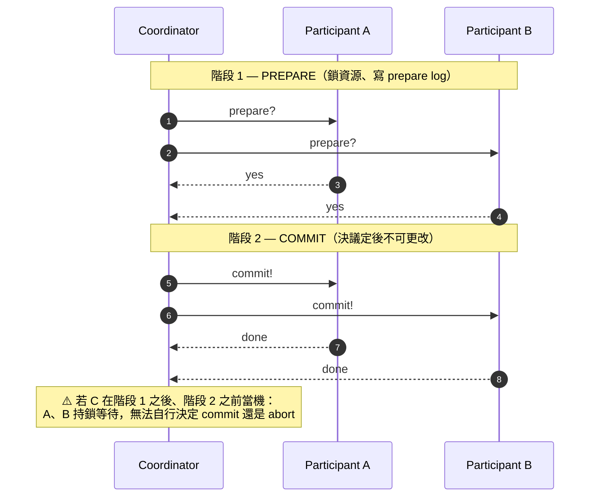
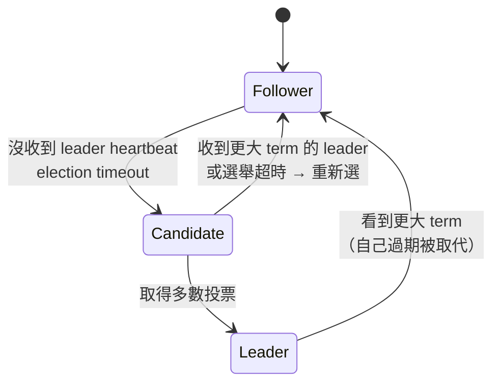
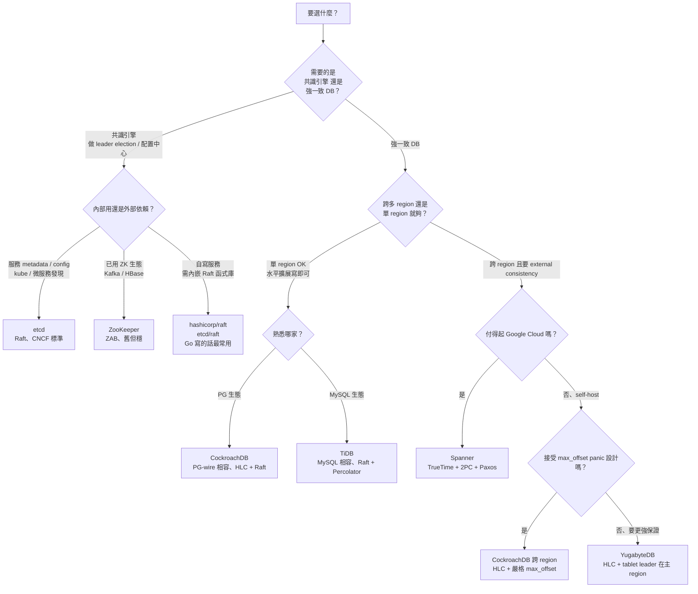

<ChapterOpener chapter-id="ch09" />

<ChapterMeta part="Part II 分散式資料" :read-time="65" difficulty="進階" :tags="['Linearizability', 'Raft', '2PC']" prereq="Ch8" />

<PrereqBox
  :prereq="['Ch5 複製（leader / follower / quorum）', 'Ch7 交易（ACID、isolation）', 'Ch8 分散式問題（時鐘、網路分區、fencing token）']"
  first-read-hint="**90-120 分鐘**——全書最硬的一章。Linearizability vs Serializability、CAP 真實意義、共識三種等價形式（全序廣播 ≡ 線性一致 KV ≡ 共識）這三組概念建議讀完先停下來自己畫一遍。沒讀過 [Raft 視覺化動畫](https://raft.github.io/) 的人強烈建議先看 10 分鐘再回來"
  :skippable="['§9.5 Paxos 細節（先抓住 vote 規則 + Log Matching、Paxos 與 Raft 的差異等之後再回頭）', '§9.6 Spanner TrueTime 數學推導第一次讀可略過、抓住「主動 wait 等不確定性過去」的核心直覺即可']"
/>

<TLDR :points='[
  "<strong>Linearizability（線性一致）= 系統表現得像只有單一副本</strong>。是分散式一致性最強保證，但要付出延遲與可用性代價。",
  "<strong>CAP 定理是被誤解最多的</strong>：實際上是「網路分區時，選 Consistency 還是 Availability」，與「正常時的 latency」無關。",
  "<strong>順序 ≠ 線性一致</strong>：因果序（causal order）只是偏序；全序廣播（total order broadcast）等價於共識。",
  "<strong>兩階段提交（2PC）是分散式交易的經典解</strong>，但有 coordinator 單點失效問題；XA 在實務中惡名昭彰。",
  "<strong>共識演算法（Raft、Paxos、ZAB）的本質是讓 N 個節點對某個值達成一致</strong>。所有「正確的」leader election、分散式鎖、原子廣播都歸結到共識。"
]' />

## 9.0 為什麼需要「一致性」這個詞？

::: tip 從一個具體場景出發
你寫了一個 Web App，背後是 3 個複製的資料庫節點。Alice 在 Tokyo 機房按下「按讚」，馬上有人在 LA 機房刷新看到讚數 —— 但**會不會看到**？

- **單機資料庫**：寫完馬上能讀到 —— 這是「強一致」的本能。
- **多副本**：寫入到底要等幾個副本確認才回 client OK？讀取打到哪個副本？這些選擇造就**不同強度的一致性保證**。

「一致性」這個詞在分散式系統有兩層用法，**千萬別混淆**：
1. **ACID 的 C**：交易執行後不違反業務不變式（這是 Ch7 主題，本章不討論）
2. **複製一致性**：多個副本之間如何呈現「同一份資料」—— **這是 Ch9 主題**
:::

### 認識三個關鍵詞（後面會反覆出現）

| 詞 | 白話 | 對應誰 |
|---|---|---|
| **Linearizability**（線性一致） | 整個系統對外表現得像「只有單一副本」，每個操作有清晰的全域順序 | Ch9.1 主題 |
| **CAP 定理** | 網路分區發生時，必須在「保一致」與「保可用」之間擇一 | Ch9.2 |
| **共識（consensus）** | N 個節點對某個值達成一致 —— 是實作 linearizable 系統的基礎工具 | Ch9.5 |

讀完本章你會了解：**一致性是設計選擇，不是免費贈品**。強保證 = 高延遲 + 可用性犧牲。多數系統在這條光譜上找平衡點。

---

## 9.1 <G term="linearizability">Linearizability</G>（線性一致性）

定義：**對外部觀察者而言，系統表現得像只有一個資料副本，且操作按時序原子發生**。

例子（不滿足線性一致）：
```
T=0  A 完成寫 x=1（client 已收到 ACK）
T=1  B 讀 x → 1   ✓
T=2  C 讀 x → 0   ✗ ← C 看到回退，違反線性一致
```

::: tip 為什麼要強調「ACK 已收到」
線性一致的精確定義是「每個操作在 invocation 與 response 之間**某個時刻原子發生**」。若 A 的寫尚未 ACK（in-flight），B 與 C 看到不同值並**不直接違反**線性一致——只有當「寫已對 client 完成 / ACK」這個事實成立、之後仍能讀到舊值，才是違反。判讀 linearizability 時要以 client 看到的 invocation/response 時間點為準（DDIA p.323-324）。
:::

### 怎麼實作
- Single-leader + 同步複製 + 讀只走 leader → 線性一致
- Quorum (W+R>N) 加 read repair → **不一定線性一致**！

::: warning Quorum 為何不夠
具體反例（DDIA p.335）—— **設定**：`N=3, W=2, R=2`，滿足 quorum 條件 `W + R = 4 > N = 3`：
1. A 寫入 `x=1`，已寫到 2/3 個副本（W=2 滿足）但 ACK 還沒回到 client
2. 此時 client B 讀 `x`（讀 2/3 個副本），**剛好讀到含新值的兩個副本** → 看到 `x=1`
3. 緊接著 client C 讀 `x`（也讀 2/3 個副本），**讀到一個新副本 + 一個舊副本** → 看到 `x=` 舊值

對外部觀察者而言「B 看到新值之後 C 又看到舊值」，違反線性一致。
**結論**：`W + R > N` 是必要條件、**不是充分條件**——quorum 不無條件保證讀到最新值。
:::

要做到線性一致需用 **ABD 演算法**（Attiya-Bar-Noy-Dolev, 1995）。**注意 ABD 的讀寫都是兩階段**：

- **讀**：階段 1 向 read quorum 拿 `(value, timestamp)`、階段 2 用讀到的最大 timestamp 把該值**寫回 write quorum** 才回應 client（避免下一次讀拿到更舊的）
- **寫**：階段 1 向 quorum 拿目前最大 timestamp、階段 2 用 `max_ts + 1` 帶值寫到 write quorum 才回應

只做「讀階段 write-back」**不夠**——寫如果不先讀 timestamp、單純塞新值，會與並發寫破壞順序仍然非線性一致。

### ABD 讀的具體時序（為什麼讀也要寫）

設 `N=3`，副本 R1 / R2 / R3。Alice 先寫 `x=1`（已到 R1、R2、ts=10），Bob 讀，Carol 接著讀：



**重點**：純 quorum read（橘色區）會放任「舊副本永遠舊」、後續 reader 可能讀到不同結果——違反線性一致。ABD 的 write-back（綠色區）強制讓**讀到的最新值散布回去**、保證後續 reader 必看到至少同樣新的值。

::: tip ABD 的適用範圍
原始 ABD 是 **single-register** 演算法（一個暫存器、single-writer multi-reader）。Lynch-Shvartsman 1997 擴成 multi-writer；要對「多個 key / multi-object linearizability」還要更多協定（leader-based 共識通常比較實際）。Cassandra 等 Dynamo 風格系統並未實作這層 —— 它們只提供最終一致性。
:::

### 代價
網路慢或不通時，要保線性一致只能拒絕服務 → **可用性下降**。

---

## 9.2 <G term="cap-theorem">CAP</G> 重新詮釋

**錯誤理解**：「3 選 2，C/A/P 都重要」
**正確理解**：
- P（網路分區）**總是會發生**，不是選項
- 真正的選擇：分區時要 **CP（拒絕服務保一致性）** 還是 **AP（繼續服務允許不一致）**
- **無分區時也有代價**：即使網路正常，更強一致 = 更高延遲（光速與多輪訊息成本），不是免費的

::: warning CAP 的 C 不是 ACID 的 C，也不是 consistent hashing 的 C
**學界三個完全不同的東西用了同一個字母**，是初學者最常踩的坑（DDIA p.336 footnote 41 對比前二者；第三條為本站補充）：

| 縮寫 | 全名 | 意思 |
|---|---|---|
| **CAP 的 C** | Consistency | **Linearizability**（複製副本之間對外觀察一致） |
| **ACID 的 C** | Consistency | **業務不變式**（如「餘額不為負」）—— 應用層責任、不是 DB 提供的 |
| **Consistent hashing 的 C** | Consistent | **「節點變動時 key→node 映射變動最小」** 的雜湊性質 |

讀文獻看到「consistent / consistency」**永遠先確認語境**，三者無關。
:::

::: tip PACELC 補完 CAP（Abadi 2012）
**P**artition 時 → 選 **A**vailability 還是 **C**onsistency；**E**lse（網路正常）→ 選 **L**atency 還是 **C**onsistency。

CAP 只談分區發生時的權衡；PACELC 加上「正常時也要在延遲與一致性之間選」，更貼近實務。Cassandra 是 PA/EL（兩邊都選 A/L），Spanner 是 PC/EC（兩邊都選 C）。
:::

::: tip 如果你是前端開發者：CRDT 是「繞過 linearizability 開銷」的近年熱門解
Figma、Linear、Notion-style 協作編輯為什麼能做到「兩人同時改、沒有 lock、結果還是收斂」？答案是 **CRDT（Conflict-free Replicated Data Type）**。

**核心想法**：用代數結構讓並發寫 **commute（可交換）** —— 不管事件以什麼順序到達各副本，最終狀態都一樣。就**不必**達成 linearizability、也**不必**跑共識，每個副本各自處理、最終一致。

| 工具 | 用途 |
|---|---|
| **Yjs** | JS 生態最熱、支援 Text / Array / Map / XML，Quill / Tiptap / Monaco 都有整合 |
| **Automerge** | Rust + JS、適合 offline-first PWA |
| **Liveblocks** | 商業 SaaS，包裝 Yjs / Automerge 給前端開發者直接用 |

**與本章的對應**：
- 線性一致 vs 因果序 vs 收斂 —— **CRDT 放棄線性一致、只要因果序 + 收斂**，所以不需要共識協定
- write skew / lost update —— 這些異常**定義在 serializable 框架下**；CRDT 不在這個框架，而是**用 commutative 結構讓「衝突寫」在資料模型層直接消失**（例如 G-Counter 的 +1 是 increment 而非 set，兩個 +1 不會互蓋；不是「擋下異常」、是「異常不存在」）

**代價**：state 結構受限（不是所有資料模型都能 CRDT 化）、metadata overhead（每個 op 帶 vector clock 或 dot）、**不適合需要強 invariant 的場景**——金融計數可以用 PNCounter，但「餘額不得為負」這類**邏輯不變式（invariant）守恆**不能靠 commutative 保證，仍要回到強一致 / 共識路徑。
:::

---

## 9.3 順序保證

### 因果序（Causal Order）
若 A 因果地早於 B，則所有觀察者都該看到 A 先於 B。
- 偏序（partial order）：不相關的事件可以任意順序
- **Lamport timestamp**（Lamport 1978）：純量，能給「與因果一致的全序」但**不能判 concurrency**（L(a) < L(b) 不蘊含 a 因果先於 b）
- **Vector clock**（Fidge 1988、Mattern 1989）：每節點一個計數器組成向量，**能完整判定**兩事件是因果相關還是並發獨立

### 全序廣播（Total Order Broadcast）
所有節點都按相同順序接收所有訊息。
- ✓ 等同於 state machine replication
- ✓ 等同於線性一致儲存
- ✓ 等同於共識

→ **這四個概念是等價的問題**。

---

## 9.4 分散式交易與<G term="2pc">兩階段提交（2PC）</G>

跨節點的原子交易怎麼做？



### 問題：Coordinator 單點失效
如果 coordinator 在「決定」與「通知」之間掛了，participants 一直鎖著資源等。

**Heuristic decisions**：當 coordinator 長時間失聯，participant 為了釋放資源而**自行決定** commit 或 abort。這會**破壞** 2PC 的原子性保證 —— 因為不同 participant 可能各自做出不同決定（A commit、B abort），結果跨節點狀態分歧。實務上只能作為緊急逃生口，並要求事後人工對帳修正。

### XA Transactions
跨資料庫的標準分散式交易（JTA 等）。實務中被吐槽：
- 慢（鎖等待 + 多輪通訊）
- 當 transaction manager (TM) 嵌入應用程式 process 時，coordinator 的決策 log 寫在應用記憶體 → 應用掛了交易也卡住
- 與「at-least-once delivery」搭配時更脆弱

### 書外延伸：現代微服務的分散式交易 pattern

DDIA 寫於 2017、聚焦在 2PC 的學術 / DB 視角。但 fintech / 電商實作上 **2PC 太昂貴、跨服務也不適用**（每個服務各自管自己的 DB），業界改用以下 pattern：

| Pattern | 核心想法 | 適用場景 | 主要痛點 |
|---|---|---|---|
| **Saga**（orchestration） | 把長交易拆成多個本地交易、用 orchestrator 協調順序、失敗時跑 compensating action 回復 | 訂單 → 庫存 → 付款 → 出貨這類**有序**多步驟 | 沒有原子性、只有最終一致；compensating action 要寫對 |
| **Saga**（choreography） | 同上、但用事件驅動（每步驟發事件、下游服務監聽），無中央 orchestrator | 服務數量少、流程簡單 | 事件依賴變複雜後難 trace |
| **Outbox pattern** | 業務 DB 寫入 + 訊息發送**包進同一個本地交易**（訊息寫到 outbox 表），背景 worker 把 outbox 內容轉發到 MQ | 「DB 寫入要可靠地觸發訊息」場景（最常見） | 需要 CDC 或 polling worker、有延遲 |
| **TCC**（Try-Confirm-Cancel） | 三階段：Try 預留資源、Confirm 真執行、Cancel 釋放 | 高一致性需求、能控制所有參與服務 | 業務邏輯侵入性大、每個操作要實作三個方法 |

::: tip 三個 pattern 怎麼選
- **「我只是 DB 寫完要發訊息給 MQ」**→ Outbox（最簡單、最可靠）
- **「跨多服務的長流程」**→ Saga（接受最終一致性 + 寫好 compensating action）
- **「跨服務的強一致性、能改所有服務」**→ TCC（很少場景值得這成本，多半是金融核心）
- **「跨 DB（同公司）」**→ XA / 2PC（如果服務在同一 process 內、且 DB 都支援）

**參考**：[microservices.io patterns](https://microservices.io/patterns/data/saga.html)（Chris Richardson 整理）。Saga compensating action 不是 rollback——是「**邏輯上**的取消」（例：訂單成立失敗、要發退款而不是 `DELETE` 已 commit 的記錄）。
:::

---

<SectionDivider icon="hub" label="核心機制" />

## 9.5 <G term="consensus">共識（Consensus）</G> {#consensus-section}

### 共識問題
N 個節點，每個提出一個值，要達成（依 DDIA p.365 / "Consensus Algorithms and Total Order Broadcast"）：
- **一致同意（Uniform Agreement）**：沒有兩個節點 decide 不同的值
- **完整性（Integrity）**：每個節點**至多 decide 一次**（不會反悔、不會 decide 兩次）
- **有效性（Validity）**：decide 的值必須是**某個節點實際提過的**（不能憑空生成值）
- **終止（Termination）**：非當機節點最終會做出決定（**前提：多數可用 _且_ 網路最終足夠穩定** — 這是 partial synchrony 假設下的 GST, Global Stabilization Time）

::: warning 不要把 Validity 與「同值多數決」混淆
有些文獻把「若全節點提同值，則 decide 該值」當成另一種強 validity / non-triviality，但**那不是 DDIA 用的版本**。本書的 Validity 只要求「decide 的值來自某個 proposer」——這個較弱版本是實際共識演算法（Paxos / Raft）真正保證的。
:::

### FLP 不可能性
**「在純非同步、可能有節點當機的網路中，沒有確定性演算法能保證共識會終止」**

→ 實務系統繞過 FLP 的方法：
- **partial synchrony 假設**（Dwork-Lynch-Stockmeyer 1988）：假設網路最終會穩定下來（GST 之後延遲有上界），這時共識能終止。Paxos / Raft 的證明都在這個模型下做。
- **隨機性**：Ben-Or 1983 的隨機演算法能用機率 1 終止（雖然不是確定性）。
- **timeout + leader**：Raft 用 randomized election timeout 降低活鎖（livelock）機率，但**不保證消除**——網路若持續不穩仍可能無限選舉。

### 經典演算法
- **Paxos**（Lamport, 1998；手稿 1989）：嚴謹但極難實作正確
- **Raft**（Ongaro & Ousterhout, Stanford, 2014）：為易理解而設計，etcd / Consul / TiKV 採用
- **ZAB**：ZooKeeper 使用

### Raft 的三個核心
1. **Leader election**：term + 投票 + heartbeat
2. **Log replication**：leader 寫入 log，多數 ACK 才 commit
3. **Safety**：term 大者勝、log 完整者勝、commit 後不變



### 為什麼需要 term？

光有 log index 不夠。想像網路分區：
```
時間 →
分區 1（多數派）：leader A 寫 index=5, 6, 7   ← 這些可以 commit
分區 2（少數派）：leader B 寫 index=5', 6'    ← 這些不該 commit
        分區恢復...
```
單看 index，A 跟 B 都「自認為 index=5 是對的」。

**Term 解決**：每次選舉 term + 1（term 是節點本地的計數器，**遞增不需要任何人同意**——所以 B 在少數派也能把 term 一路飆高）。但 B **拿不到 majority vote** 因而**選不出 leader**，所以 B 那邊的 entry 永遠 commit 不了。

分區恢復時兩件事護住安全性：
1. **更大 term 強制 step down**：A（舊 leader）看到 B 的較大 term 會 step down 變 follower、跟著遞增自己的 term 重選——所以「term 大者勝」這條成立的不是「少數派的 term 較小」，而是「看到較大 term 就退位」
2. **Vote 規則 + Leader Completeness**：candidate 要拿到 majority vote，而 vote 規則要求 **voter 自己的 log 不能比 candidate 還新**（最後一個 entry 的 `(term, index)` 字典序比較）。B 在少數派沒收到 A 那邊已 commit 的 entry，所以 majority 中至少一個 voter 會看到 B 的 log 比自己舊 → **拒絕投票** → B 永遠選不出 leader

→ 結論：少數派分區的寫入永遠 commit 不了，這是「vote 規則」而非「term 不會增加」保證的。

> **Term = 邏輯時鐘**，等同 [Ch8 的 fencing token](/part-2/ch08-trouble) 在共識協定裡的化身：「過期的 leader」一旦看到更大 term 就被識別並 step down。但安全性的根（為什麼少數派寫入 commit 不了）是 vote 規則 + Log Matching，不是 term 本身。

### 共識的代價
- 需要多數可用（5 節點要 3 個活）
- 動態變更成員麻煩（joint consensus）
- 網路分區時少數派完全卡死

---

## 9.6 ZooKeeper 與成員協調

ZooKeeper（Apache）= 給其他系統用的共識服務。提供：
- 線性一致 KV 寫入
- 全序的觀察者通知（watch）
- Ephemeral nodes（client 斷線就消失，用於 leader election、heartbeat）

許多 DB（HBase、Kafka 舊版、ClickHouse）依賴 ZooKeeper 做元資料管理。新一代用 etcd（基於 Raft）。

### Kafka KRaft：從 ZooKeeper 到自管 Raft

Kafka 從 2.8（2021）引入 **KRaft** mode（Kafka Raft），3.3（2022）production-ready，**4.0（2025）完全移除 ZooKeeper 依賴**。

| 維度 | Kafka + ZooKeeper（傳統） | KRaft（現代） |
|---|---|---|
| 控制平面 | ZK ensemble（3-5 節點獨立部署） | Kafka 自己跑 Raft 在 controller 節點上 |
| Metadata 一致性 | ZK 的 ZAB | Raft（自管） |
| Leader epoch | 對應 controller epoch | **同樣是 Raft term** |
| 維運 | 要管兩套系統（Kafka + ZK） | 單一系統 |
| Cluster 啟動 | 等 ZK ready 才啟動 broker | broker / controller 同一進程 |

::: tip Kafka leader epoch ≈ Raft term
Kafka producer 帶的 `leader_epoch` 與 Raft 的 `term` 角色相同：擋住 zombie leader 的寫入。當 broker 看到比自己 `leader_epoch` 大的訊息來自前任 leader、會拒絕該寫入——這就是 [§9.5 的 vote 規則 + Log Matching](#9-5-共識-consensus) 在 Kafka 的化身。

對升級到 KRaft 的維運影響：**只改了 metadata 怎麼共識、producer / consumer API 完全不變**；transactional producer / EOS 機制是另一個獨立子系統（[詳見 Ch11 §11.5](/part-3/ch11-streams)）、跟 ZK / KRaft 都無關。
:::

### Spanner TrueTime 與 commit-wait

Spanner（Google 2012）做到 **external consistency**（= strict serializability）的關鍵是 **TrueTime API**：

- **核心抽象**：`TT.now()` 不回傳單一時間戳，而是回傳區間 `[earliest, latest]`，保證真實時間在這區間內
- **ε 邊界**：2012 OSDI 論文公布 **ε 平均 ~6ms、worst case ~10ms**（不是上界 7ms、坊間常見錯誤）；commit-wait 實際時間 ≈ **2ε**、典型 ~10-14ms。現代資料中心透過更密的 time master、ε 已降至 ms / sub-ms 級、Google 未公開實際數字
- **commit-wait**：交易 commit 時，Spanner 會**主動 sleep 直到 `latest` 過去**，確保「我 commit 後、任何下次的 TT.now() 都比我大」→ 線性一致時序就成立。**注意 wait 時間不是固定常數**——取決於當下 ε、GPS / 原子鐘異常時 ε 會 spike、commit-wait 跟著拉長

```
T1 commit @ TT = [100, 110]   (ε ≈ 5ms)
  ↓ 強制 sleep 到 latest=110 過去 (≈ 2ε ≈ 10ms)
T2 開始讀 @ TT = [115, 125] → 必定大於 T1 的 latest
```

::: warning ε 不是常數
GPS 收訊干擾、原子鐘漂移、time master 失聯都會讓 ε 瞬間升高、commit-wait 跟著變長。Google 的 SRE 報告提過罕見 ε spike 到數十 ms 的事件——Spanner 的承諾是「**永不違反 external consistency**」、不是「**永遠快**」。
:::

**對比 HLC**（CockroachDB / YugabyteDB 用的）：
- HLC（Hybrid Logical Clock）只**緩解**時鐘漂移、不消除——當實體時鐘誤差超過 max_offset（CRDB 預設 500ms）會直接 panic
- TrueTime 用**主動 wait** 把不確定性「等過去」、付出延遲代價買到嚴格一致性
- 沒 Google 級基礎設施（GPS + 原子鐘）的公司通常選 HLC + max_offset 容忍機制

> Spanner 也提供 **stale read**（指定一個過去時間點讀）讓延遲敏感應用避開 commit-wait——但這就不是線性一致了，是「明確標示的歷史讀」。

---

## 9.7 共識 / 分散式 SQL 選型決策樹

把 Raft / Paxos / Spanner / CRDB 等選擇壓成一張圖：



**選型快速結論**：
- 服務配置中心 / leader election → **etcd**（Kubernetes 早就這樣選）
- 跨機房強一致 + Google Cloud → **Spanner**
- 跨機房強一致 + self-host → **CockroachDB** 或 **YugabyteDB**
- 已用 ZK / Kafka 生態 → 沿用 **ZooKeeper**
- 自寫 Go 服務內嵌共識 → **hashicorp/raft** 或 **etcd/raft**

::: warning 不要自己寫 Raft
本書講共識的細節是為了**讓你看懂為什麼這些東西貴**，**不是鼓勵你自己實作**。Raft / Paxos 的邊界情況（split-brain、leader lease、log compaction、joint consensus 動態成員變更）每一個都會在 production 撞鞋——直接用驗證過的函式庫或 etcd / ZK 服務。
:::

---

## 章末練習

::: tip 思考題
1. 用 `hashicorp/raft` 或 etcd 的 Go 函式庫實作一個 3 節點的分散式 KV store。
2. 觀察 leader 被 kill 後多久重新選出（measure failover time）。
3. 故意制造網路分區（3 節點切成 2+1），觀察少數派的行為。
4. 思考題：為什麼說「全序廣播 ≡ 線性一致儲存 ≡ 共識」？舉例說明可以互相歸約。
:::

<Quiz chapter-id="ch09" :questions='[
  {
    difficulty: "basic",
    question: "Linearizability 的本質定義是？",
    options: [
      "資料按時間順序儲存",
      "整個分散式系統對外表現得像「只有單一資料副本」，操作的可見性是即時且原子的",
      "所有讀取都比寫入快",
      "資料庫支援 SQL"
    ],
    answer: 1,
    explanation: "Linearizability = 強一致性的形式定義：每個操作看起來在某個瞬時點原子發生，且這些瞬時點順序與真實時序一致。觀察者看不出系統有多個副本。"
  },
  {
    difficulty: "interview",
    question: "CAP 定理的正確詮釋是？",
    options: [
      "在任何時刻，分散式系統只能滿足 C/A/P 三者中的兩個",
      "網路分區（P）會發生，所以實際選擇是分區時要 CP（拒服務保一致）或 AP（繼服務容不一致）",
      "Consistency 與 Availability 互相矛盾",
      "Partition Tolerance 是可以選擇放棄的"
    ],
    answer: 1,
    explanation: "P 不是選項，是現實。CAP 真正講的是「分區發生時的選擇」。許多人錯把「正常時無 P」當成可以選 CA，但實際上正常時根本不需要選 —— 你都拿得到。",
    sectionAnchor: "_9-2-cap-重新詮釋"
  },
  {
    difficulty: "interview",
    question: "FLP 不可能性結果告訴我們什麼？",
    options: [
      "分散式共識完全不可能",
      "在純非同步、可能崩潰節點的網路中，沒有確定性演算法保證共識會終止；實務系統靠 timeout/隨機性繞過",
      "Paxos 是錯的",
      "只要節點足夠多就能解決一切問題"
    ],
    answer: 1,
    explanation: "FLP 是理論下限：純非同步 + 可能崩潰 → 你做不出「保證終止」的確定演算法。Raft/Paxos 不違反它 —— 它們用 timeout 假設「夠長時間後網路會穩定」來確保實務上終止。"
  },
  {
    difficulty: "applied",
    question: "兩階段提交（2PC）的最大實務問題是？",
    options: [
      "需要 SSD 才能運作",
      "Coordinator 在 prepare 完成後若崩潰，participants 會一直鎖定資源等待，造成阻塞",
      "只能支援 2 個節點",
      "不能跨資料中心"
    ],
    answer: 1,
    explanation: "2PC 是阻塞協定 —— prepare 後決定權集中在 coordinator，它若掛了，participants 處於「不能 commit 也不能 abort」的狀態，鎖會一直拿著。XA 在實務中惡名昭彰部分來自此。"
  },
  {
    difficulty: "interview",
    question: "下列何者與「共識（consensus）」等價？",
    options: [
      "兩階段鎖",
      "線性一致儲存系統 ≡ 全序廣播 ≡ 共識，三者可互相歸約",
      "Snapshot Isolation",
      "MapReduce"
    ],
    answer: 1,
    explanation: "DDIA 的精華洞見之一：這幾個看似不同的問題在計算複雜度上等價。能解共識就能做線性一致儲存與全序廣播，反之亦然 —— 都需要 FLP 級別的協作能力。",
    sectionAnchor: "consensus-section"
  }
]' />

<InterviewBlock chapter-id="ch09" :questions='[
  { "tag": "Raft", "question": "Raft 怎麼處理 split-brain？term 在過程中扮演什麼角色？vote 規則為什麼是真正擋住少數派 commit 的關鍵？" },
  { "tag": "名詞 disambiguation", "question": "「CAP 的 C」「ACID 的 C」「Consistent hashing 的 C」差別是什麼？哪一個跟線性一致有關？" },
  { "tag": "分散式交易", "question": "你的微服務系統需要跨服務的原子交易（訂單 → 庫存 → 付款）。請評估 2PC vs Saga vs Outbox vs TCC 的取捨、給出選型建議。" },
  { "tag": "TrueTime / HLC", "question": "Spanner 的 commit-wait 是什麼？為什麼能達成 external consistency？CockroachDB 的 HLC max_offset 預設值是多少、超出會怎樣？" }
]' />

<ChapterNote chapter-id="ch09" />

<Progress chapter-id="ch09" />

::: info 延伸閱讀
- [Raft 視覺化動畫](https://raft.github.io/) — 10 分鐘看完，先看再讀 Ch9.5
- [Raft 原論文 (In Search of an Understandable Consensus Algorithm)](https://raft.github.io/raft.pdf) — 短得意外，第 5 節是核心
- [MIT 6.824 Distributed Systems](https://pdos.csail.mit.edu/6.824/) — Lab 2 直接讓你動手實作 Raft（給 Go skeleton）
- [Jepsen analyses](https://jepsen.io/analyses) — etcd、CockroachDB 等的線性一致性實測
- [hashicorp/raft](https://github.com/hashicorp/raft) — 生產級 Raft 實作，看 snapshot / membership change
:::

<NextChapterBridge chapter-id="ch09" />
