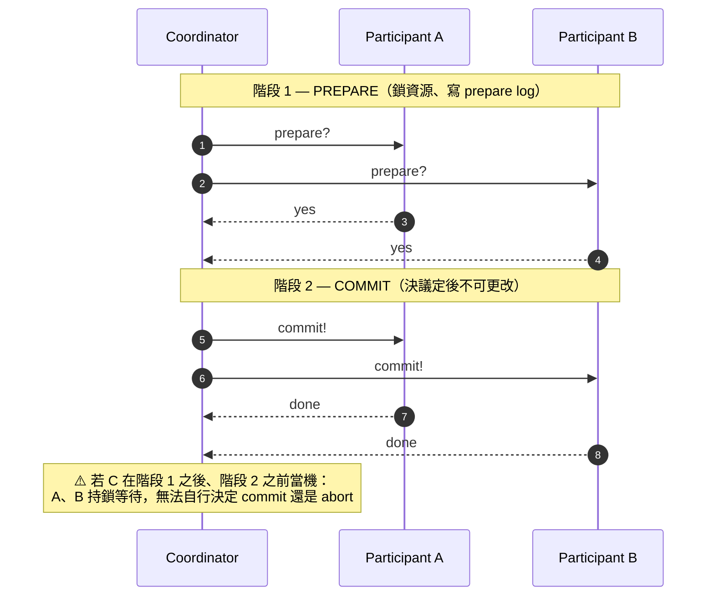
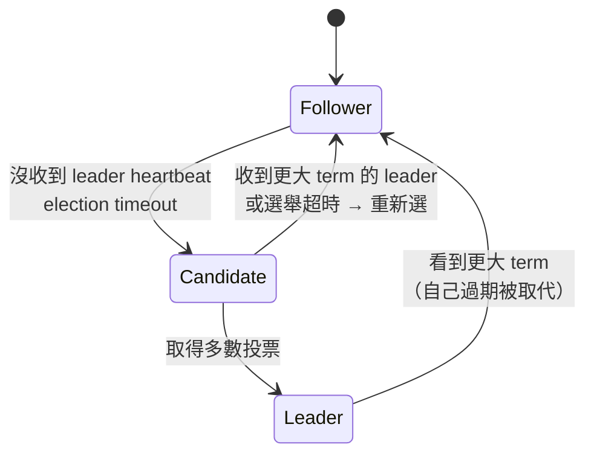

# Ch9 · 一致性與共識

<ChapterMeta part="Part II 分散式資料" :read-time="65" difficulty="進階" :tags="['Linearizability', 'Raft', '2PC']" prereq="Ch8" />

<TLDR :points='[
  "<strong>Linearizability（線性一致）= 系統表現得像只有單一副本</strong>。是分散式一致性最強保證，但要付出延遲與可用性代價。",
  "<strong>CAP 定理是被誤解最多的</strong>：實際上是「網路分區時，選 Consistency 還是 Availability」，與「正常時的 latency」無關。",
  "<strong>順序 ≠ 線性一致</strong>：因果序（causal order）只是偏序；全序廣播（total order broadcast）等價於共識。",
  "<strong>兩階段提交（2PC）是分散式交易的經典解</strong>，但有 coordinator 單點失效問題；XA 在實務中惡名昭彰。",
  "<strong>共識演算法（Raft、Paxos、ZAB）的本質是讓 N 個節點對某個值達成一致</strong>。所有「正確的」leader election、分散式鎖、原子廣播都歸結到共識。"
]' />

## 9.0 為什麼需要「一致性」這個詞？

::: tip 從一個具體場景出發
你寫了一個 Web App，背後是 3 個複製的資料庫節點。Alice 在 Tokyo 機房按下「按讚」，馬上有人在 LA 機房刷新看到讚數 —— 但**會不會看到**？

- **單機資料庫**：寫完馬上能讀到 —— 這是「強一致」的本能。
- **多副本**：寫入到底要等幾個副本確認才回 client OK？讀取打到哪個副本？這些選擇造就**不同強度的一致性保證**。

「一致性」這個詞在分散式系統有兩層用法，**千萬別混淆**：
1. **ACID 的 C**：交易執行後不違反業務不變式（這是 Ch7 主題，本章不討論）
2. **複製一致性**：多個副本之間如何呈現「同一份資料」—— **這是 Ch9 主題**
:::

### 認識三個關鍵詞（後面會反覆出現）

| 詞 | 白話 | 對應誰 |
|---|---|---|
| **Linearizability**（線性一致） | 整個系統對外表現得像「只有單一副本」，每個操作有清晰的全域順序 | Ch9.1 主題 |
| **CAP 定理** | 網路分區發生時，必須在「保一致」與「保可用」之間擇一 | Ch9.2 |
| **共識（consensus）** | N 個節點對某個值達成一致 —— 是實作 linearizable 系統的基礎工具 | Ch9.5 |

讀完本章你會了解：**一致性是設計選擇，不是免費贈品**。強保證 = 高延遲 + 可用性犧牲。多數系統在這條光譜上找平衡點。

---

## 9.1 <G term="linearizability">Linearizability</G>（線性一致性）

定義：**對外部觀察者而言，系統表現得像只有一個資料副本，且操作按時序原子發生**。

例子（不滿足線性一致）：
```
T=0  A 寫 x=1
T=1  B 讀 x → 1   ✓
T=2  C 讀 x → 0   ✗ ← C 看到回退，違反線性一致
```

### 怎麼實作
- Single-leader + 同步複製 + 讀只走 leader → 線性一致
- Quorum (W+R>N) 加 read repair → **不一定線性一致**！

::: warning Quorum 為何不夠
具體反例（DDIA p.335）—— **設定**：`N=3, W=2, R=2`，滿足 quorum 條件 `W + R = 4 > N = 3`：
1. A 寫入 `x=1`，已寫到 2/3 個副本（W=2 滿足）但 ACK 還沒回到 client
2. 此時 client B 讀 `x`（讀 2/3 個副本），**剛好讀到含新值的兩個副本** → 看到 `x=1`
3. 緊接著 client C 讀 `x`（也讀 2/3 個副本），**讀到一個新副本 + 一個舊副本** → 看到 `x=` 舊值

對外部觀察者而言「B 看到新值之後 C 又看到舊值」，違反線性一致。
**結論**：`W + R > N` 是必要條件、**不是充分條件**——quorum 不無條件保證讀到最新值。
:::

要做到線性一致需用 **ABD 演算法**（Attiya-Bar-Noy-Dolev, 1995）：讀取後**強制把讀到的最新值寫回 quorum 個副本**才回應 client（不是「所有副本」—— 網路分區時也做不到所有）。Cassandra 等 Dynamo 風格系統並未實作這層 —— 它們只提供最終一致性。

### 代價
網路慢或不通時，要保線性一致只能拒絕服務 → **可用性下降**。

---

## 9.2 <G term="cap-theorem">CAP</G> 重新詮釋

**錯誤理解**：「3 選 2，C/A/P 都重要」
**正確理解**：
- P（網路分區）**總是會發生**，不是選項
- 真正的選擇：分區時要 **CP（拒絕服務保一致性）** 還是 **AP（繼續服務允許不一致）**
- **無分區時也有代價**：即使網路正常，更強一致 = 更高延遲（光速與多輪訊息成本），不是免費的

::: tip PACELC 補完 CAP（Abadi 2012）
**P**artition 時 → 選 **A**vailability 還是 **C**onsistency；**E**lse（網路正常）→ 選 **L**atency 還是 **C**onsistency。

CAP 只談分區發生時的權衡；PACELC 加上「正常時也要在延遲與一致性之間選」，更貼近實務。Cassandra 是 PA/EL（兩邊都選 A/L），Spanner 是 PC/EC（兩邊都選 C）。
:::

::: tip 如果你是前端開發者：CRDT 是「繞過 linearizability 開銷」的近年熱門解
Figma、Linear、Notion-style 協作編輯為什麼能做到「兩人同時改、沒有 lock、結果還是收斂」？答案是 **CRDT（Conflict-free Replicated Data Type）**。

**核心想法**：用代數結構讓並發寫 **commute（可交換）** —— 不管事件以什麼順序到達各副本，最終狀態都一樣。就**不必**達成 linearizability、也**不必**跑共識，每個副本各自處理、最終一致。

| 工具 | 用途 |
|---|---|
| **Yjs** | JS 生態最熱、支援 Text / Array / Map / XML，Quill / Tiptap / Monaco 都有整合 |
| **Automerge** | Rust + JS、適合 offline-first PWA |
| **Liveblocks** | 商業 SaaS，包裝 Yjs / Automerge 給前端開發者直接用 |

**與本章的對應**：
- 線性一致 vs 因果序 vs 收斂 —— **CRDT 放棄線性一致、只要因果序 + 收斂**，所以不需要共識協定
- write skew / lost update —— 這些異常**定義在 serializable 框架下**；CRDT 不在這個框架，而是**用 commutative 結構讓「衝突寫」在資料模型層直接消失**（例如 G-Counter 的 +1 是 increment 而非 set，兩個 +1 不會互蓋；不是「擋下異常」、是「異常不存在」）

**代價**：state 結構受限（不是所有資料模型都能 CRDT 化）、metadata overhead（每個 op 帶 vector clock 或 dot）、**不適合需要強 invariant 的場景**——金融計數可以用 PNCounter，但「餘額不得為負」這類**邏輯不變式（invariant）守恆**不能靠 commutative 保證，仍要回到強一致 / 共識路徑。
:::

---

## 9.3 順序保證

### 因果序（Causal Order）
若 A 因果地早於 B，則所有觀察者都該看到 A 先於 B。
- 偏序（partial order）：不相關的事件可以任意順序
- **Lamport timestamp**（Lamport 1978）：純量，能給「與因果一致的全序」但**不能判 concurrency**（L(a) < L(b) 不蘊含 a 因果先於 b）
- **Vector clock**（Fidge 1988、Mattern 1989）：每節點一個計數器組成向量，**能完整判定**兩事件是因果相關還是並發獨立

### 全序廣播（Total Order Broadcast）
所有節點都按相同順序接收所有訊息。
- ✓ 等同於 state machine replication
- ✓ 等同於線性一致儲存
- ✓ 等同於共識

→ **這四個概念是等價的問題**。

---

## 9.4 分散式交易與<G term="2pc">兩階段提交（2PC）</G>

跨節點的原子交易怎麼做？



### 問題：Coordinator 單點失效
如果 coordinator 在「決定」與「通知」之間掛了，participants 一直鎖著資源等。

**Heuristic decisions**：當 coordinator 長時間失聯，participant 為了釋放資源而**自行決定** commit 或 abort。這會**破壞** 2PC 的原子性保證 —— 因為不同 participant 可能各自做出不同決定（A commit、B abort），結果跨節點狀態分歧。實務上只能作為緊急逃生口，並要求事後人工對帳修正。

### XA Transactions
跨資料庫的標準分散式交易（JTA 等）。實務中被吐槽：
- 慢（鎖等待 + 多輪通訊）
- 當 transaction manager (TM) 嵌入應用程式 process 時，coordinator 的決策 log 寫在應用記憶體 → 應用掛了交易也卡住
- 與「at-least-once delivery」搭配時更脆弱

---

<SectionDivider icon="hub" label="核心機制" />

## 9.5 <G term="consensus">共識（Consensus）</G>

### 共識問題
N 個節點，每個提出一個值，要達成：
- **一致性（Agreement）**：所有節點決定同一個值
- **完整性（Integrity）**：值必須是某節點提過的
- **有效性（Validity）**：若全節點提同值，必選該值
- **終止（Termination）**：非當機節點最終會做出決定（**前提：多數可用 _且_ 網路最終足夠穩定** — 這是 partial synchrony 假設下的 GST, Global Stabilization Time）

### FLP 不可能性
**「在純非同步、可能有節點當機的網路中，沒有確定性演算法能保證共識會終止」**

→ 實務系統繞過 FLP 的方法：
- **partial synchrony 假設**（Dwork-Lynch-Stockmeyer 1988）：假設網路最終會穩定下來（GST 之後延遲有上界），這時共識能終止。Paxos / Raft 的證明都在這個模型下做。
- **隨機性**：Ben-Or 1983 的隨機演算法能用機率 1 終止（雖然不是確定性）。
- **timeout + leader**：Raft 用 randomized election timeout 降低活鎖（livelock）機率，但**不保證消除**——網路若持續不穩仍可能無限選舉。

### 經典演算法
- **Paxos**（Lamport, 1998；手稿 1989）：嚴謹但極難實作正確
- **Raft**（Ongaro & Ousterhout, Stanford, 2014）：為易理解而設計，etcd / Consul / TiKV 採用
- **ZAB**：ZooKeeper 使用

### Raft 的三個核心
1. **Leader election**：term + 投票 + heartbeat
2. **Log replication**：leader 寫入 log，多數 ACK 才 commit
3. **Safety**：term 大者勝、log 完整者勝、commit 後不變



### 為什麼需要 term？

光有 log index 不夠。想像網路分區：
```
時間 →
分區 1（多數派）：leader A 寫 index=5, 6, 7   ← 這些可以 commit
分區 2（少數派）：leader B 寫 index=5', 6'    ← 這些不該 commit
        分區恢復...
```
單看 index，A 跟 B 都「自認為 index=5 是對的」。

**Term 解決**：每次選舉 term + 1。B 選舉時因為少數派**選不出新 term**（拿不到多數票），所以 B 的 term 一定 ≤ A 的 term。合併時 follower 看到「更大 term 的 entry」就丟棄自己 term 較小的 log。

> **Term = 邏輯時鐘**，等同 [Ch8 的 fencing token](/part-2/ch08-trouble) 在共識協定裡的化身：「過期的 leader」一定帶著較小的 term，可以被識別並排除。

### 共識的代價
- 需要多數可用（5 節點要 3 個活）
- 動態變更成員麻煩（joint consensus）
- 網路分區時少數派完全卡死

---

## 9.6 ZooKeeper 與成員協調

ZooKeeper（Apache）= 給其他系統用的共識服務。提供：
- 線性一致 KV 寫入
- 全序的觀察者通知（watch）
- Ephemeral nodes（client 斷線就消失，用於 leader election、heartbeat）

許多 DB（HBase、Kafka 舊版、ClickHouse）依賴 ZooKeeper 做元資料管理。新一代用 etcd（基於 Raft）。

---

## 章末練習

::: tip 思考題
1. 用 `hashicorp/raft` 或 etcd 的 Go 函式庫實作一個 3 節點的分散式 KV store。
2. 觀察 leader 被 kill 後多久重新選出（measure failover time）。
3. 故意制造網路分區（3 節點切成 2+1），觀察少數派的行為。
4. 思考題：為什麼說「全序廣播 ≡ 線性一致儲存 ≡ 共識」？舉例說明可以互相歸約。
:::

<Quiz chapter-id="ch09" :questions='[
  {
    question: "Linearizability 的本質定義是？",
    options: [
      "資料按時間順序儲存",
      "整個分散式系統對外表現得像「只有單一資料副本」，操作的可見性是即時且原子的",
      "所有讀取都比寫入快",
      "資料庫支援 SQL"
    ],
    answer: 1,
    explanation: "Linearizability = 強一致性的形式定義：每個操作看起來在某個瞬時點原子發生，且這些瞬時點順序與真實時序一致。觀察者看不出系統有多個副本。"
  },
  {
    question: "CAP 定理的正確詮釋是？",
    options: [
      "在任何時刻，分散式系統只能滿足 C/A/P 三者中的兩個",
      "網路分區（P）會發生，所以實際選擇是分區時要 CP（拒服務保一致）或 AP（繼服務容不一致）",
      "Consistency 與 Availability 互相矛盾",
      "Partition Tolerance 是可以選擇放棄的"
    ],
    answer: 1,
    explanation: "P 不是選項，是現實。CAP 真正講的是「分區發生時的選擇」。許多人錯把「正常時無 P」當成可以選 CA，但實際上正常時根本不需要選 —— 你都拿得到。"
  },
  {
    question: "FLP 不可能性結果告訴我們什麼？",
    options: [
      "分散式共識完全不可能",
      "在純非同步、可能崩潰節點的網路中，沒有確定性演算法保證共識會終止；實務系統靠 timeout/隨機性繞過",
      "Paxos 是錯的",
      "只要節點足夠多就能解決一切問題"
    ],
    answer: 1,
    explanation: "FLP 是理論下限：純非同步 + 可能崩潰 → 你做不出「保證終止」的確定演算法。Raft/Paxos 不違反它 —— 它們用 timeout 假設「夠長時間後網路會穩定」來確保實務上終止。"
  },
  {
    question: "兩階段提交（2PC）的最大實務問題是？",
    options: [
      "需要 SSD 才能運作",
      "Coordinator 在 prepare 完成後若崩潰，participants 會一直鎖定資源等待，造成阻塞",
      "只能支援 2 個節點",
      "不能跨資料中心"
    ],
    answer: 1,
    explanation: "2PC 是阻塞協定 —— prepare 後決定權集中在 coordinator，它若掛了，participants 處於「不能 commit 也不能 abort」的狀態，鎖會一直拿著。XA 在實務中惡名昭彰部分來自此。"
  },
  {
    question: "下列何者與「共識（consensus）」等價？",
    options: [
      "兩階段鎖",
      "線性一致儲存系統 ≡ 全序廣播 ≡ 共識，三者可互相歸約",
      "Snapshot Isolation",
      "MapReduce"
    ],
    answer: 1,
    explanation: "DDIA 的精華洞見之一：這幾個看似不同的問題在計算複雜度上等價。能解共識就能做線性一致儲存與全序廣播，反之亦然 —— 都需要 FLP 級別的協作能力。"
  }
]' />

<Progress chapter-id="ch09" />

::: info 延伸閱讀
- [Raft 視覺化動畫](https://raft.github.io/) — 10 分鐘看完，先看再讀 Ch9.5
- [Raft 原論文 (In Search of an Understandable Consensus Algorithm)](https://raft.github.io/raft.pdf) — 短得意外，第 5 節是核心
- [MIT 6.824 Distributed Systems](https://pdos.csail.mit.edu/6.824/) — Lab 2 直接讓你動手實作 Raft（給 Go skeleton）
- [Jepsen analyses](https://jepsen.io/analyses) — etcd、CockroachDB 等的線性一致性實測
- [hashicorp/raft](https://github.com/hashicorp/raft) — 生產級 Raft 實作，看 snapshot / membership change
:::

<NextChapterBridge next-link="/part-3/ch10-batch" next-title="Ch10 批次處理 Batch">
Part II 結束 —— 你已掌握「線上系統」的核心問題。從 Ch10 進入 <strong>Part III 衍生資料</strong>：從原始資料導出新資料的兩種典範。批次處理（MapReduce / Spark）是「定期把大量資料壓成新結果」的世界，是資料倉儲、ML 訓練、報表的基礎。
</NextChapterBridge>
