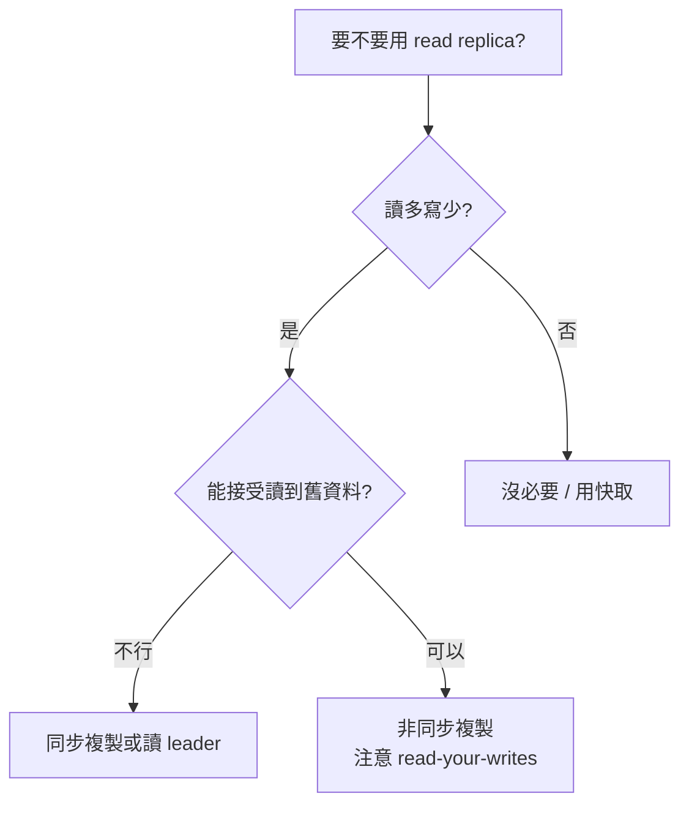
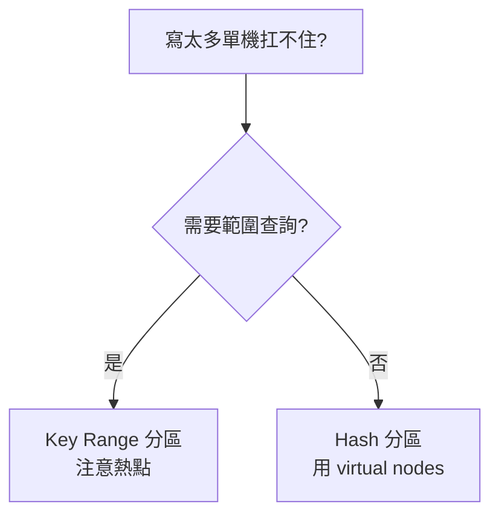
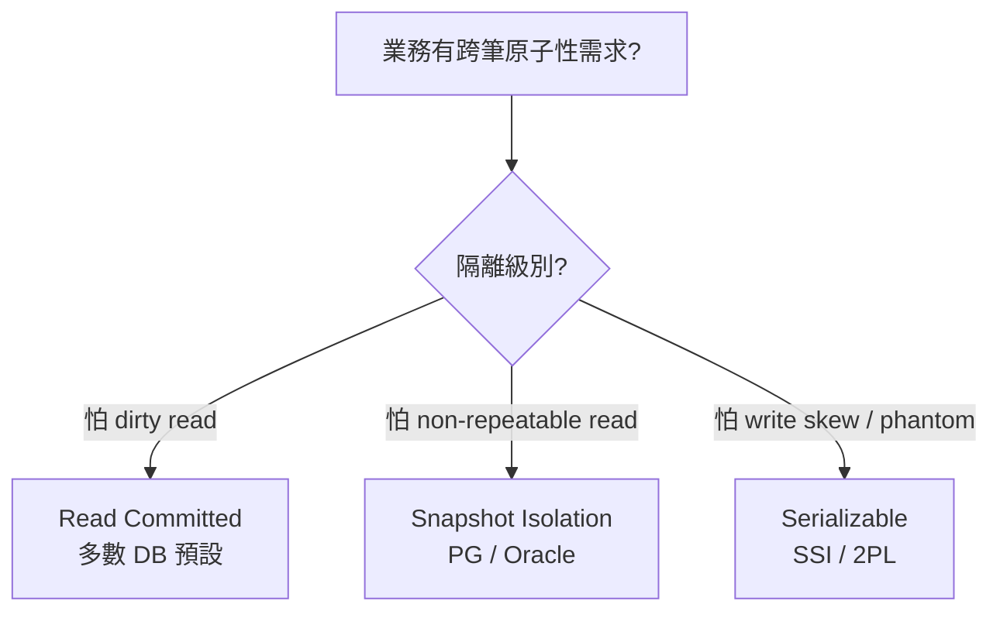
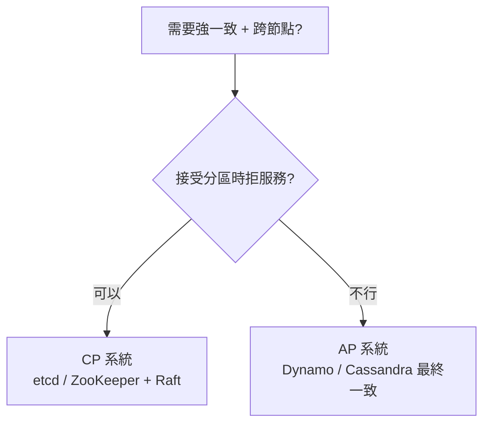

# Part II · 分散式資料

> 把資料分布到多台機器：複製、分區、交易、共識

這是 DDIA 全書最硬核的部分，也是把你從「會用 DB」升級為「懂分散式系統」的關鍵五章。Ch8 與 Ch9 尤其燒腦，建議連續、不分心地讀。

## 學習目標

讀完 Part II，你應該能：
- 解釋為什麼「強一致」與「高可用」在網路分區時不能兼得（CAP 的正確版）
- 知道何時用 single-leader、multi-leader、leaderless 複製
- 看到一筆 SQL 交易就知道它在 Read Committed / Snapshot Isolation / Serializable 下會發生什麼
- 描述 Raft 是怎麼選 leader、怎麼複製 log 的
- 對「分散式鎖」抱持健康的懷疑（fencing token）

## 章節地圖

```
Ch5 複製 ──┐
            ├─→ Ch6 分區 ──┐
            │              │
            │              ↓
            └──────────────→ Ch7 交易
                            ↓
            Ch8 分散式系統的麻煩（網路、時鐘、暫停）
                            ↓
            Ch9 一致性與共識（必須先讀 Ch8）

強依賴：Ch8 → Ch9
建議順序：Ch5 → Ch6 → Ch7 → Ch8 → Ch9（線性，全部讀完）
```

<div class="ddia-chapter-grid">
  <ChapterCard id="ch05" num="CH 05" title="複製 Replication" summary="Leader/Follower、多主、無主；同步 vs 非同步；Quorum 與版本向量" link="/part-2/ch05-replication" :read-time="55" />
  <ChapterCard id="ch06" num="CH 06" title="分區 Partitioning" summary="Sharding 策略、二級索引、Rebalancing、請求路由與 ZooKeeper" link="/part-2/ch06-partitioning" :read-time="40" />
  <ChapterCard id="ch07" num="CH 07" title="交易 Transactions" summary="ACID 真相、Snapshot Isolation、Write Skew、SSI" link="/part-2/ch07-transactions" :read-time="60" />
  <ChapterCard id="ch08" num="CH 08" title="分散式系統的麻煩" summary="部分失效、不可靠網路、時鐘漂移、Process Pause" link="/part-2/ch08-trouble" :read-time="50" />
  <ChapterCard id="ch09" num="CH 09" title="一致性與共識" summary="Linearizability、CAP、2PC、Raft、ZooKeeper" link="/part-2/ch09-consistency" :read-time="65" />
</div>

::: warning Part II 的閱讀建議
- Ch8 與 Ch9 概念密度極高，**不要試圖一天讀完**。每章拆 2-3 個時段。
- 建議搭配 [Raft 的視覺化動畫](https://raft.github.io/) 一起讀 Ch9。
- 如果你只能挑三章：**Ch5、Ch7、Ch9**。
:::

## 讀完這部分，你應該能做的決策 {.role-h2 .icon-account_tree}

Part II 五章對應五類「**該怎麼選**」的決策。下面 4 棵獨立決策樹分別對應其中四類最常被問到的——

### 1. 要不要用 read replica?（Ch5）



### 2. 寫太多單機扛不住要怎麼分區?（Ch6）



### 3. 業務有跨筆原子性需求 → 選哪個隔離級別?（Ch7）



### 4. 需要強一致 + 跨節點 → CP 還是 AP?（Ch8 / Ch9）



Part II 訓練的核心能力：**遇到分散式資料情境時，能說出取捨在哪、有哪些選項、選錯的代價是什麼**。Part III 我們會把這些放大到「資料平台」尺度討論。
