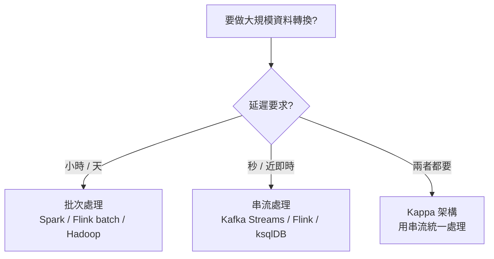
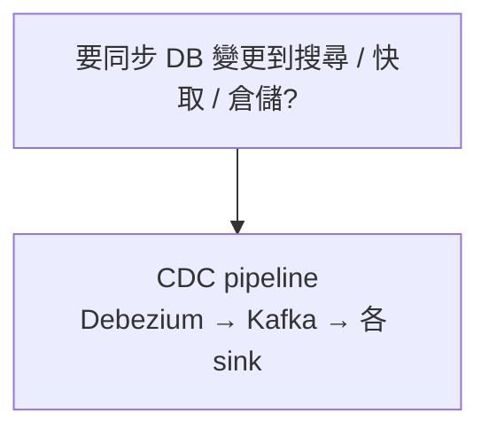
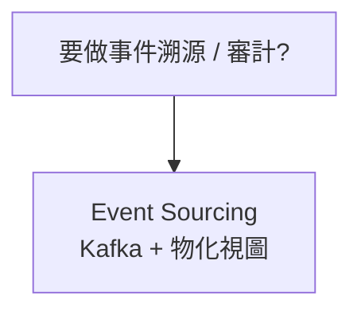
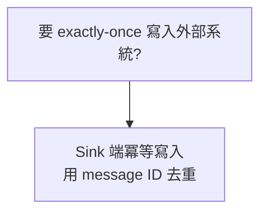
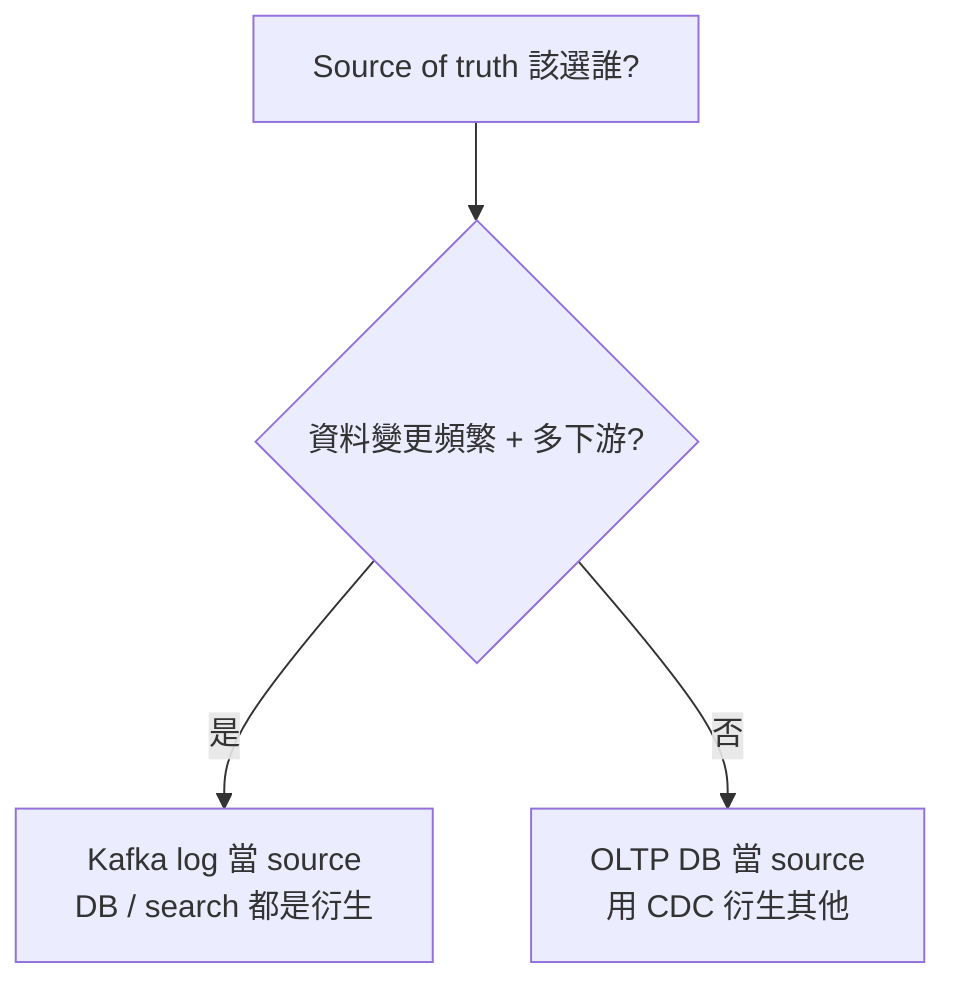

# Part III · 衍生資料

> 從原始資料導出新資料：批次與串流的兩種典範

最後三章把全書的洞見整合起來：現代資料平台不是一個 monolithic DB，而是**事件流 + 多個衍生系統**的整合。

## 學習目標

讀完 Part III，你應該能：
- 解釋 MapReduce / Spark / Flink 的演化邏輯
- 在「批次」與「串流」之間做出有依據的選擇
- 設計 CDC pipeline，把 OLTP DB 變更同步到 search index / data warehouse
- 理解 Lambda 與 Kappa 架構的權衡
- 看待資料倫理問題（隱私、偏見、監控）

## 章節地圖

```
Ch10 批次處理（MapReduce、Spark）
       ↓
Ch11 串流處理（Kafka、CDC、Event Sourcing）
       ↓
Ch12 資料系統的未來（整合與倫理）

建議順序：線性，且建議連續閱讀（三章互相呼應）
```

<div class="ddia-chapter-grid">
  <ChapterCard id="ch10" num="CH 10" title="批次處理 Batch" summary="Unix 哲學、MapReduce、Dataflow 引擎、Join 策略" link="/part-3/ch10-batch" :read-time="55" />
  <ChapterCard id="ch11" num="CH 11" title="串流處理 Stream" summary="Kafka、CDC、Event Sourcing、Stream-Table 對偶" link="/part-3/ch11-streams" :read-time="55" />
  <ChapterCard id="ch12" num="CH 12" title="資料系統的未來" summary="Lambda/Kappa、Unbundling、端到端正確性、倫理" link="/part-3/ch12-future" :read-time="40" />
</div>

::: tip 與工作的連結
Part III 的概念在實務工作中應用最廣。讀完後建議找一個你工作環境裡的系統（資料平台、後端管線），用這三章的詞彙重新描述一次它的架構 —— 你會發現很多之前看似神秘的設計選擇瞬間清晰。
:::

## 讀完這部分，你應該能做的決策 {.role-h2 .icon-account_tree}

Part III 把資料系統視為「**source of truth event log + 多種衍生視圖**」。下面 5 棵獨立決策樹是讀完最常被問到的——

### 1. 大規模資料轉換選批次還是串流?（Ch10 / Ch11）



### 2. 要同步 DB 變更到搜尋 / 快取 / 倉儲?（Ch11）



### 3. 要做事件溯源 / 審計?（Ch11）



### 4. 要 exactly-once 寫入外部系統?（Ch11 / Ch12）



### 5. Source of truth 該選誰?（Ch12）



Part III 把全書串起來：「**資料系統不是單一 DB，而是多個專門系統 + 事件流的整合**」。讀完 12 章後，建議拿一個你熟悉的系統用這些觀念重新解構一次 —— 那才是真正把 DDIA 學會的開始。
